Lab 200
============================

Container Cloud Service Hands-on Guide
======================================

*OCCS 대시보드 이해*
====================

Introduction 
-------------

이 튜토리얼은 Oracle Container Cloud Service 대시보드의 계략적인 이해를 목표로
합니다.

### Objectives

-   Dashboard

-   Search

-   Tasks & Events

-   Services

-   Stacks

-   Deployments

-   Containers

-   Images

-   Hosts

-   Resource Pools

-   Registries

-   Tags

-   Service Discovery

### Required Artifacts 

Oracle Container Cloud Service 사용하기 전에:

Oracle Container Cloud Service 가입을 주문하고 활성화 했어야 합니다.

자세한 내용은 Oracle 도움말 센터에서 [Oracle Container Cloud
Service](http://docs.oracle.com/cloud/latest/container-cloud/CONTU/toc.htm)
사용을 참조하십시오.

### Outline

>   [Introduction 2](#introduction)

>   [Objectives 2](#objectives)

>   [Required Artifacts 2](#required-artifacts)

>   [Outline 3](#outline)

>   [Dashboard 5](#dashboard)

>   [Description 5](#description)

>   [Operation 5](#operation)

>   [Search 11](#search)

>   [Description 11](#description-1)

>   [Operation 12](#operation-1)

>   [Tasks & Events 13](#tasks-events)

>   [Description 13](#description-2)

>   [Operation 14](#_Toc479855092)

>   [Services 15](#services)

>   [Description 15](#description-3)

>   [Operation 16](#operation-3)

>   [Stacks 20](#stacks)

>   [Description 20](#description-4)

>   [Operation 21](#operation-4)

>   [Deployments 25](#deployments)

>   [Description 25](#description-5)

>   [Operation 26](#operation-5)

>   [Containers 34](#containers)

>   [Description 34](#description-6)

>   [Operation 35](#operation-6)

>   [Images 39](#images)

>   [Description 39](#description-7)

>   [Operation 40](#operation-7)

>   [Hosts 45](#hosts)

>   [Description 45](#description-8)

>   [Operation 46](#operation-8)

>   [Resource Pools 52](#resource-pools)

>   [Description 52](#description-9)

>   [Operation 53](#operation-9)

>   [Registries 56](#registries)

>   [Description 56](#description-10)

>   [Operation 57](#operation-10)

>   [Tags 58](#tags)

>   [Description 58](#description-11)

>   [Operation 59](#operation-11)

>   [Service Discovery 60](#service-discovery)

>   [Description 60](#description-12)

>   [Operation 61](#operation-12)

Dashboard 
----------

Oracle Container Cloud Service의 Container 콘솔 로그인을 하면 다음 대시보드를
확인할 수 있습니다.

### Description

Oracle Container Cloud Service의 컨테이너 콘솔은 Docker환경에서 이미지,
컨테이너, 레지스트리 그래피컬한 대시보드, 편집기, 뷰 등을 제공합니다.

대시보드 페이지는 다음을 포함됩니다.

-   **Deployments**, **Hosts** 와 **Resource Pools** health check 상태를
    표시하는 자세한 상태 확인 패널

-   Oracle Container Cloud Service가 현재 관리하고 있는 **Services**,
    **Stacks**, **Deployments**, **Resource Pools**, **Containers**, **Images**
    와 **Hosts**에 대한 요약 패널들

### Operation

-   **Deployments**를 클릭합니다.

    

>   자세한 내용은 [Deployments](#deployments) 를 참조하십시오.

-   **Hosts** 클릭

    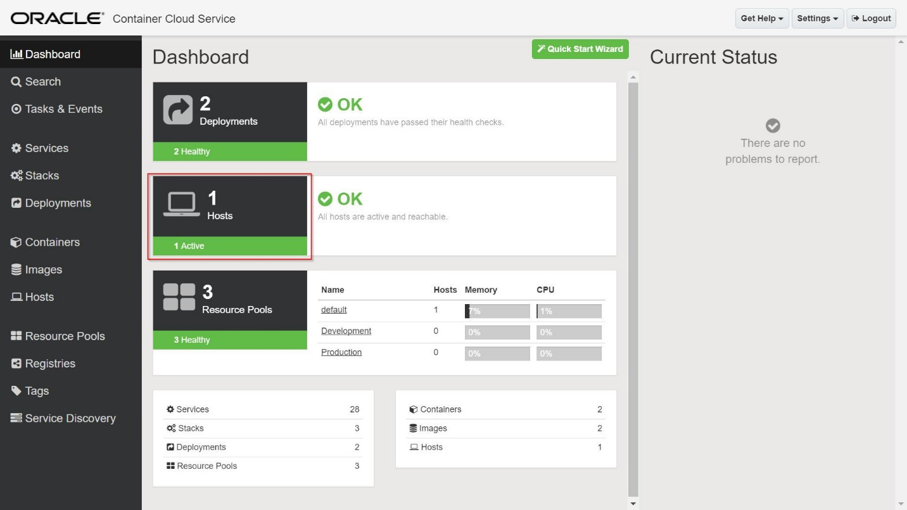

    자세한 내용은 [Hosts](#hosts) 를 참조하십시오.

-   **Resource Pools** 클릭

    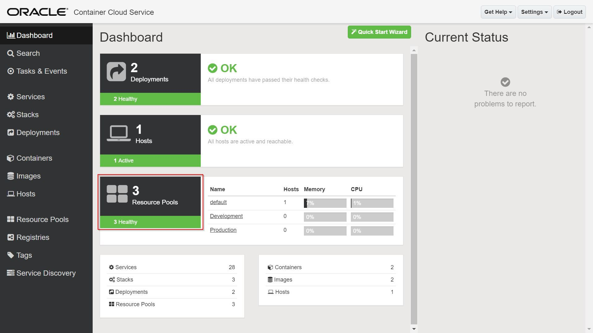

    자세한 내용은 [Resource Pools](#resource-pools) 을 참조하십시오

-   **Services** 클릭

    

    자세한 내용은 [Services](#_Services) 를 참조하십시오.

-   Stacks 클릭

    

    자세한 내용은 Stacks 를 참조하십시오

-   **Deployments** 클릭

    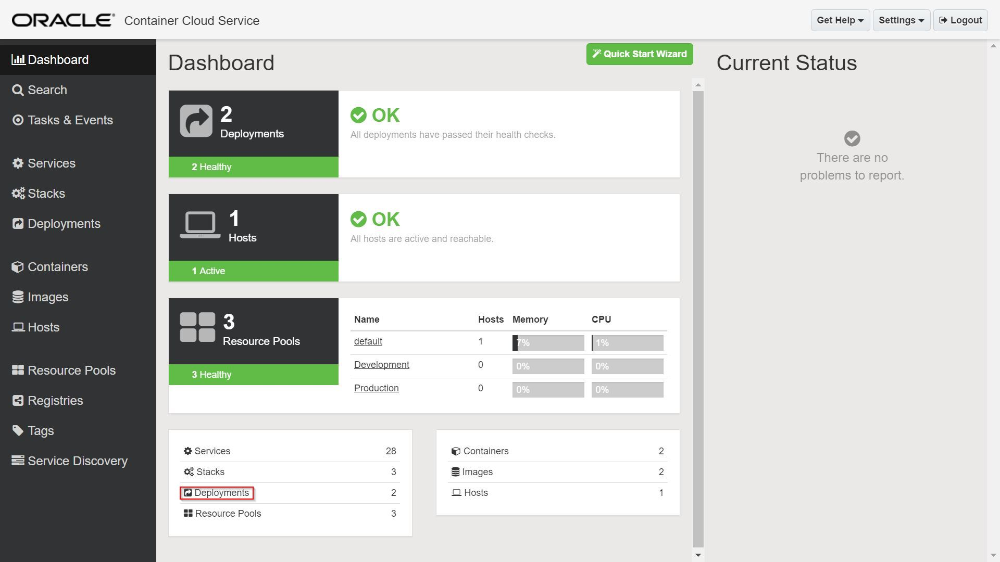

    자세한 내용은 [Deployments](#deployments) 클릭

-   **Resource Pools** 클릭

    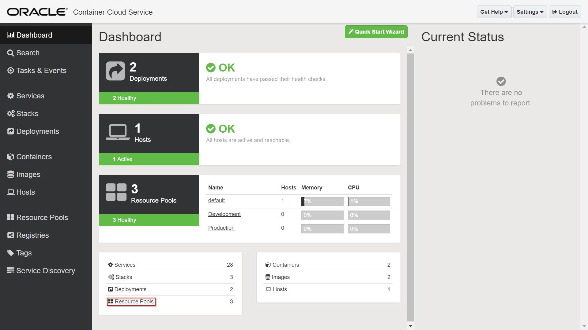

    자세한 내용은 [Resource Pools](#resource-pools) 클릭

-   **Containers** 클릭

    

    자세한 내용은 [Containers](#containers) 클릭

-   **Images** 클릭

    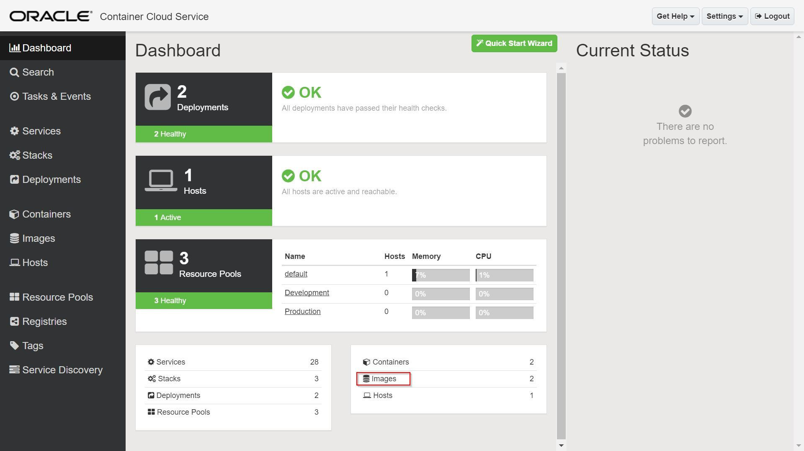

    자세한 내용은 [Images](#images) 클릭

-   **Hosts** 클릭

    

    자세한 내용은 [Hosts](#hosts) 클릭

Search
------

### Description

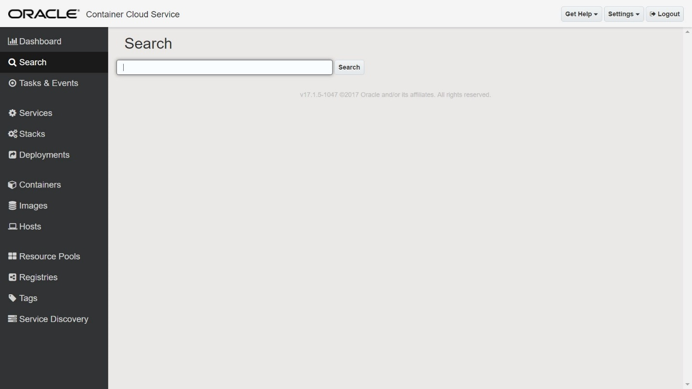

검색 패널은 이름을 검색하여 Oracle Container Cloud Service가 관리하는 개체를
찾는 데 사용됩니다.

검색 페이지를 사용하여 신속하게 검색하고 관리하십시오.

-   services

-   stacks

-   deployments

-   containers

-   images

-   hosts

-   resource pools

-   registries

### Operation

-   항목 검색

Tasks & Events
--------------

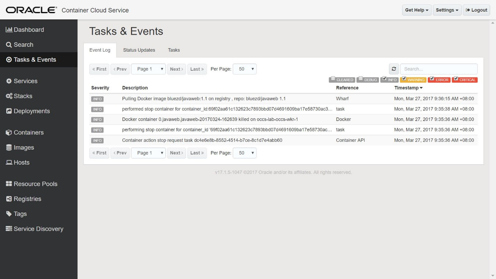

### Description

작업 및 이벤트 패널은 작업, 이벤트 및 상태 업데이트를보고 Docker 환경을
모니터링하는 데 사용됩니다.

이벤트는 개별적인 작업입니다. 예를 들어 Oracle Container Cloud Service Container
Console을 사용하여 서비스를 배포하는 경우 5 개의 개별 이벤트가 시작될 수
있습니다.

-   add a deployment

-   pull a Docker image from a registry

-   confirm that the Docker image has been pulled

-   create a Docker image on host

-   start the Docker image

상태 업데이트는 특정 되풀이되는 이벤트 및 작업의 진행 상황을보고합니다 (예 :
배포 시작 또는 상태 확인 실행). 상태 업데이트에는 수명주기가 있으며 심각도 및
설명이 변경 될 수 있음을 의미합니다. 예를 들어, 컨테이너 작성 이벤트는 초기에
실패하고 심각도가 오류 인 상태 갱신을 생성 할 수 있습니다. 그러나 동일한
컨테이너 작성 이벤트가 성공적으로 다시 실행되면 기존 상태 업데이트의 심각도가
지워짐으로 다운 그레이드되고 설명이 변경됩니다. 모든 이벤트가 상태 업데이트를
생성하지는 않습니다.

태스크는 요청에 대한 응답으로 Oracle Container Cloud Service에 의해 작성된 취소
가능한 조치입니다. 작업은 장기간 실행되며 여러 이벤트와 개체를 포함 할 수
있습니다. 예를 들어 여러 컨테이너를 중지하면 Oracle Container Cloud Service는 각
컨테이너의 여러 이벤트가 완료되는 데 약간의 시간이 걸리기 때문에 사용자 대신
작업을 수행하는 태스크를 작성합니다. 모든 작업은 상태 업데이트를 생성하며 작업이
아직 실행 중일 때 취소 할 수 있습니다.

Oracle Container Cloud Service는 이벤트 및 상태 업데이트를 심각도 수준으로
분류합니다.

### Operation

-   Event Log, Status Updates, Tasks를 확인 하십시오

Services
--------

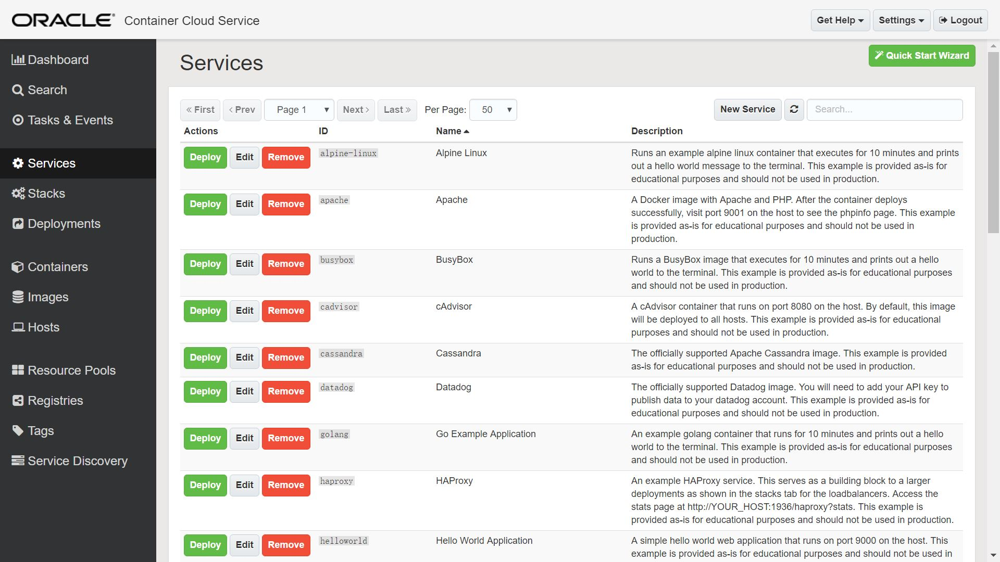

### Description

서비스 패널은 새로운 서비스를 생성하고 Oracle Container Cloud Service와 함께
제공되는 미리 구성된 서비스뿐만 아니라 사용자가 작성한 서비스를 배치 및 관리하는
데 사용됩니다.

Oracle Container Cloud Service Services는 Docker 이미지를 호스트의 컨테이너로
실행하는 데 필요한 모든 구성과 기본 배포(deployment) 지시문으로 구성됩니다.

서비스 자체는 컨테이너가 아니며 컨테이너에서 실행중인 이미지도 아니라는 것을
알아야 합니다. 서비스는 Oracle Container Cloud Service를 사용하여 생성, 배포 및
관리 할 수있는 고급 구성 객체입니다. 서비스를 컨테이너 ‘template’으로 생각하거나
실행 컨테이너를 배포하기 위해 따라야 할 지침 세트로 생각 할 수 있습니다.

Oracle Container Cloud Service에는 여러 가지 사전 구성된 서비스가 제공됩니다.
이러한 사전 구성된 서비스를 그대로 사용하거나 사용자 정의하고 저장할 수 있습니다
이미지를 지정하고 Oracle Container Cloud Service Container 콘솔에서 구성 옵션을
설정하여 새 서비스를 생성 할 수도 있습니다.

-   리스트로부터 옵션을 선택

-   Docker 실행 명령을 복사하고 붙여넣기

-   YAML 코드를 복사하고 붙여 넣기

이후에 더 이상 서비스가 필요 없다고 판단되면 Oracle Container Cloud Service
데이터베이스에서 서비스 정의를 제거 할 수 있습니다. 서비스를 기반으로 실행중인
배포가 이미있는 경우 서비스 정의를 제거해도 현재 실행중인 컨테이너에는
영향을주지 않습니다.

### Operation

-   새 서비스 만들기

    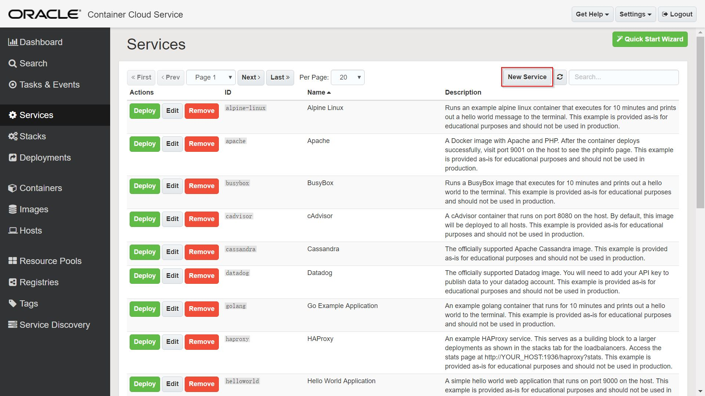

    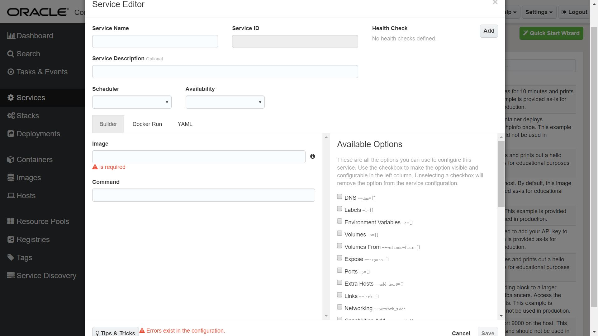

-   기존 서비스 편집

    

    

-   서비스 제거

    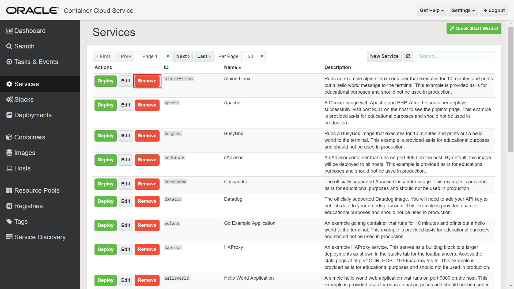

-   서비스 배포

    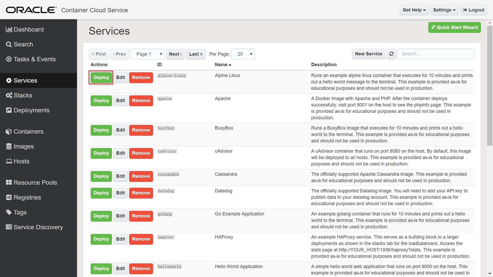

Stacks
------

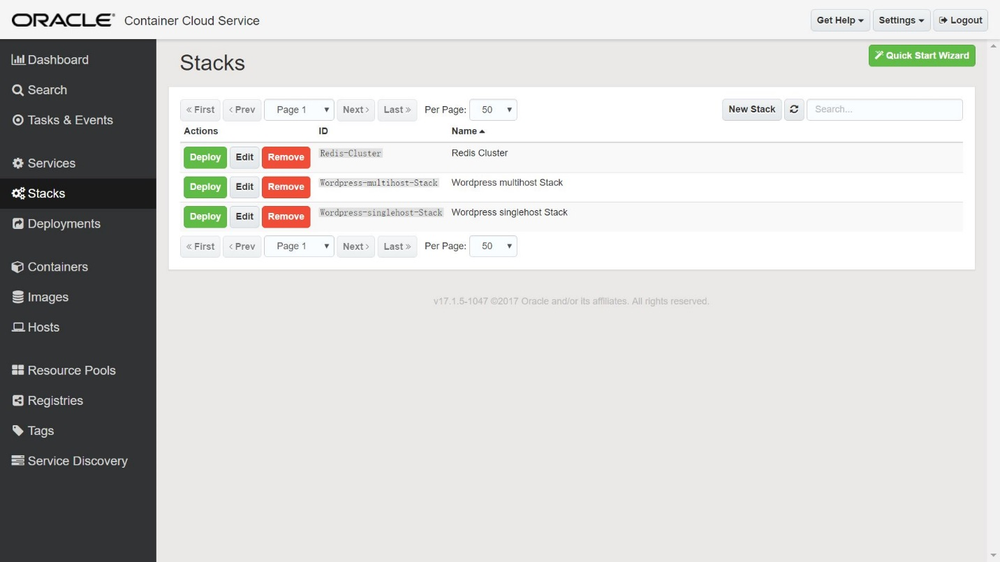

### Description

Stacks 패널은 새로운 스택을 생성하고 Oracle Container Cloud Service와 함께
제공되는 미리 구성된 스택뿐만 아니라 사용자가 생성 한 스택을 배포 및 관리하는 데
사용됩니다.

Oracle Container Cloud Service 애플리케이션 stack (또는 간단히 ‘stack’)은 Docker
컨테이너로 서비스 집합을 조율 된 방식으로 실행하고 단일 엔티티로 관리되는 기본
구성 지시자와 함께 관리하기 위해 필요한 모든 구성을 포함합니다.

Stack 자체는 컨테이너나 컨테이너에서 실행되는 이미지가 아니며 Oracle Container
Cloud Service를 사용하여 생성, 배포 및 관리 할 수있는 고급 구성 객체입니다.

예를 들어 Stack은 하나 이상의 WordPress 컨테이너와 MariaDB 컨테이너 일 수
있습니다. 마찬가지로 데이터베이스 또는 응용 프로그램 노드의 클러스터를 Stack으로
빌드 할 수 있습니다.

Oracle Container Cloud Service에는 미리 구성된 여러 Stack이 있습니다. Stack을
기반으로 실행중인 배포가 이미있는 경우나 Stack 정의를 제거해도 현재 실행중인
컨테이너에는 영향을주지 않습니다.

### Operation

-   새로운 Stack 만들기

    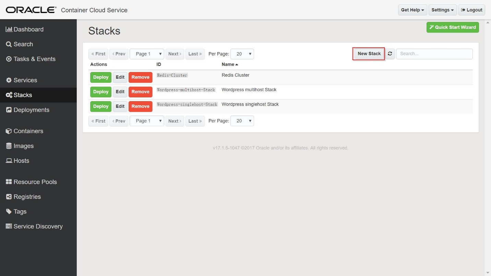

    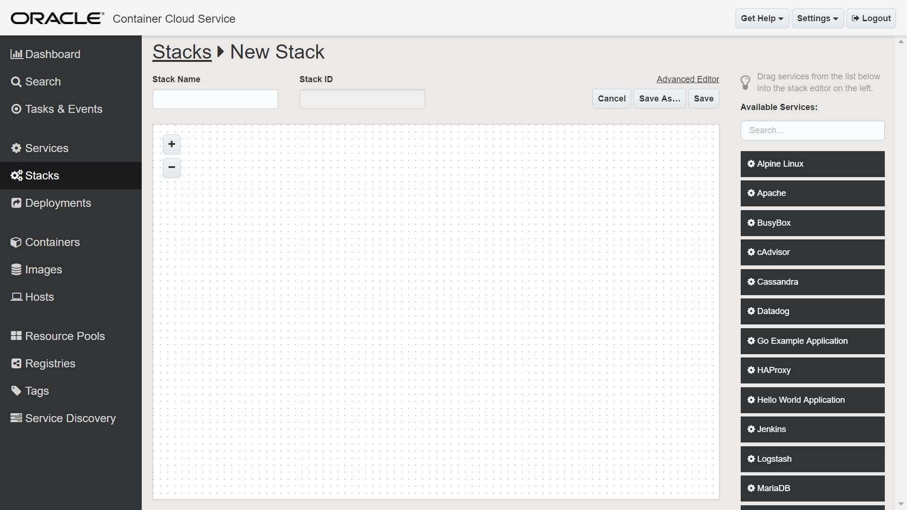

-   기존 Stack 편집

    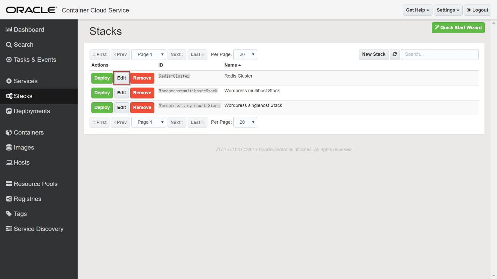

    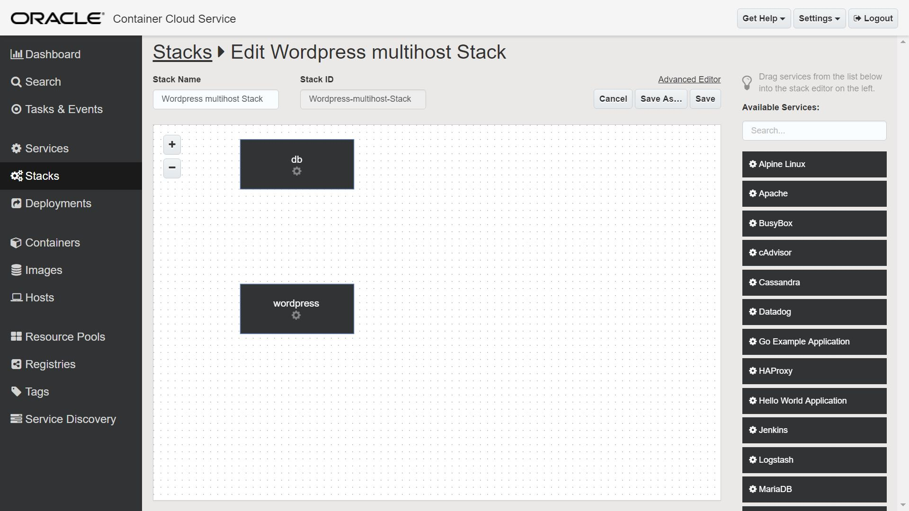

-   Stack 제거

    

-   Stack 배포

    

Deployments
-----------

### Description

Deployments 패널은 배포 된 서비스 및 Stack을 관리 및 모니터링하고 실행중인
배포를 확장하고 배포를 중지했다가 다시 시작하는 데 사용됩니다.

Oracle Container Cloud Service 배포는 사용자가 정의한 일련의 오케스트레이션
규칙에 따라 Docker 컨테이너가 관리, 배포 및 확장되는 서비스 또는 Stack으로
구성됩니다. 서비스 또는 Stack을 배포 할 때마다 Oracle Container Cloud Service는
배포를 생성합니다. 단일 배포로 인해 하나 또는 여러 개의 Docker 컨테이너가 하나
이상의 리소스 풀에 생성 될 수 있습니다. 당신이 같은 서비스(또는 Stack)을 여러 번
배포한다면, Oracle Container Cloud Service는 해당 배포 개수 만큼 생성합니다.

Oracle Container Cloud Service가 제공하는 오케스트레이션 기능은 서비스 및
Stack을 배포 할 때 시작됩니다. 서비스 또는 stack을 배포하면 ‘deployment 객체’
또는 간단히 ‘deployment’가 생성됩니다.. 도커 이미지를 가져오고, Docker
컨테이너를 만들고, 서비스 간의 통신 경로를 설정합니다. 오케스트레이션 규칙은 풀,
호스트 또는 태그 당 실행할 컨테이너의 수와 컨테이너를 실행할 호스트를 선택하는
방법을 지정합니다. 서비스 및 스택 정의를 사용하여 기본 오케스트레이션 정책을
저장하지만 특정 배포에 대한 기본 정책을 재정의 할 수 있습니다.

각 배포는 고유하며 자체 라이프 사이클이 있습니다. 배포를 클릭하면 배포가
만들어집니다. 이후에 배포를 중지하면 배포 용으로 생성 된 컨테이너가 중지되고
제거됩니다. 중지 된 배치를 다시 시작하면 동일한 배치 ID가 유지되지만 새로운
배치가 작성됩니다.

### Operation

여기 2가지 deployments 가 있습니다. 다음 작업을 수행할 수 있습니다.

-   deployments를 중지하고, Actions 컬럼에서 **STOP** 버튼을 클릭하십시오.

    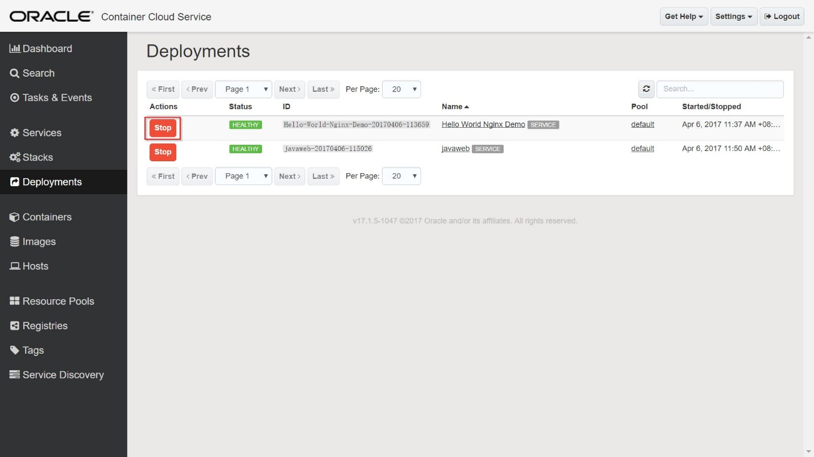

-   deployment의 자세한 status를 확인하고, Name 컬럼에 deployment 이름을
    클릭합니다.

    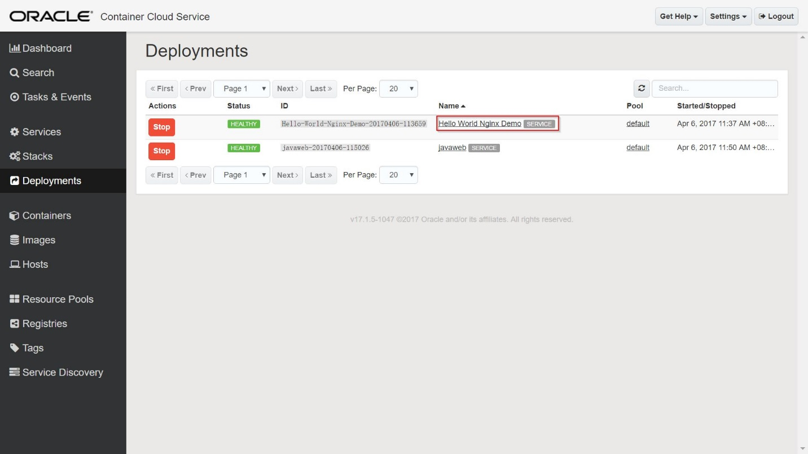

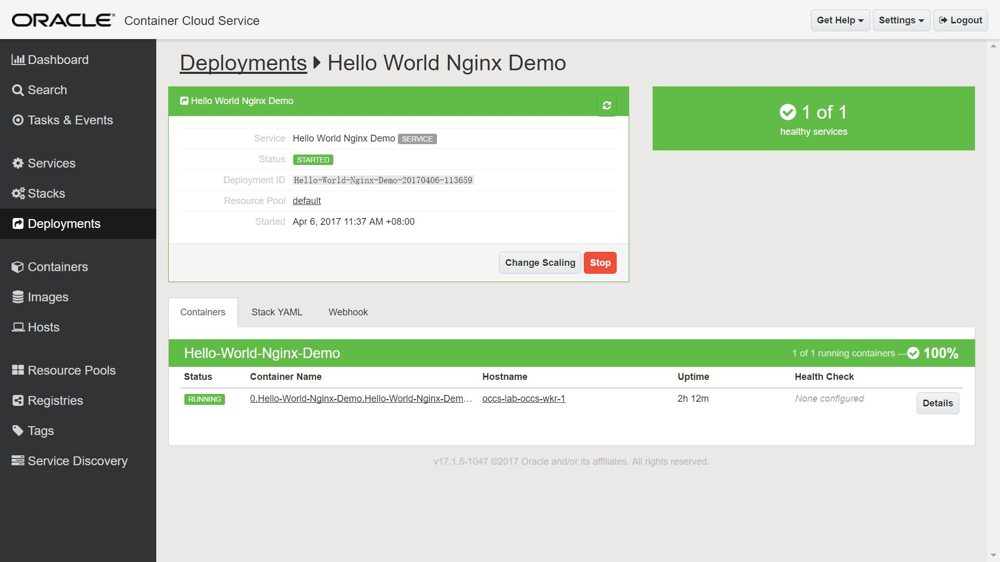

detail page에서 다음 작업을 수행할 수 있습니다.:

-   deployment 중지

    

-   Scaling 변경

    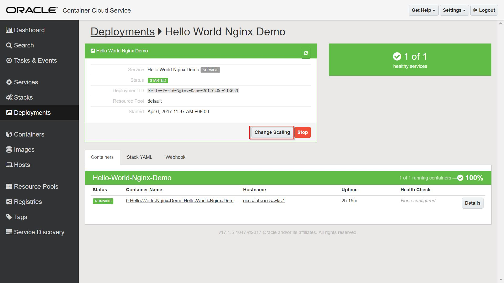

    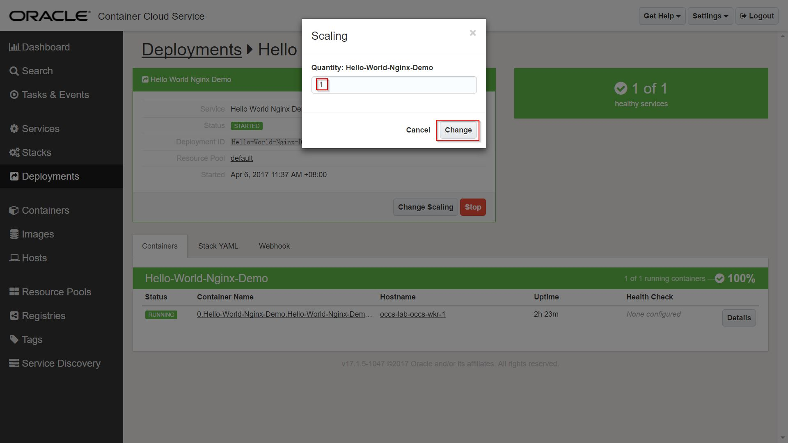

-   Container detail정보 확인

    

    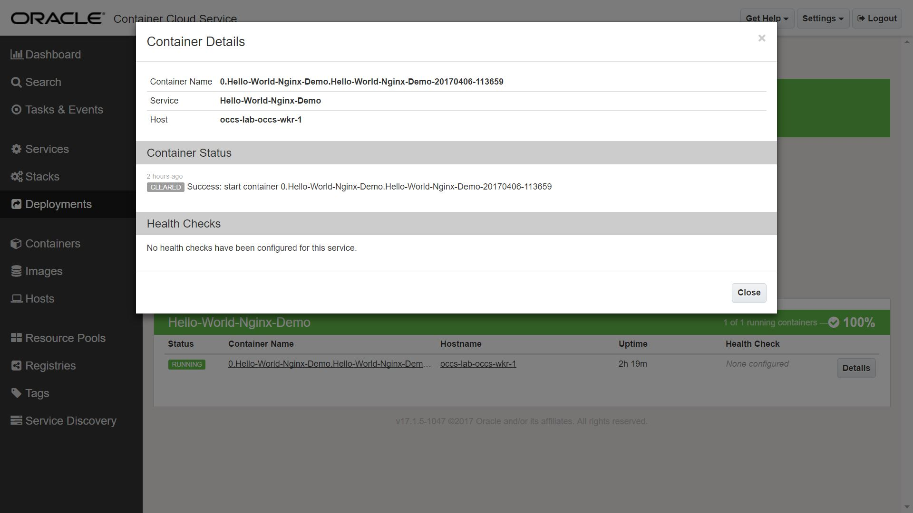

-   컨테이너 정보를 확인하려면 컨테이너 이름을 클릭하십시오.

    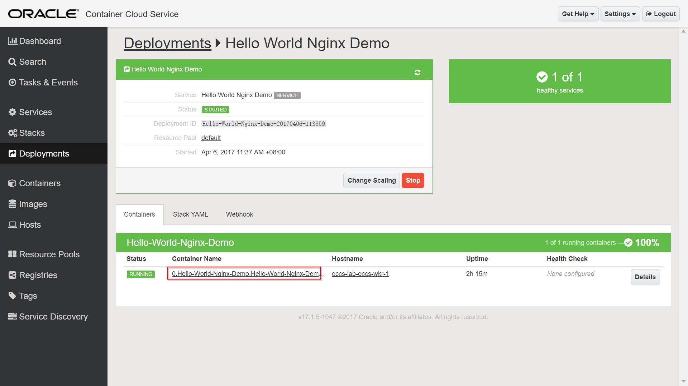

    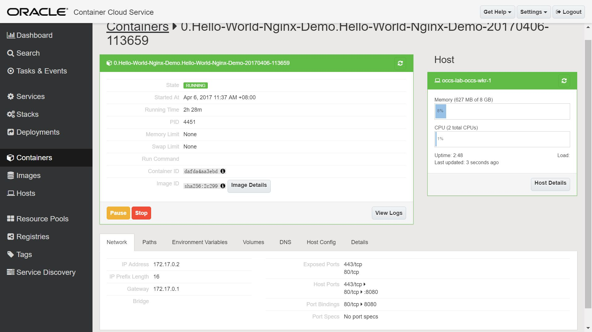

    컨테이너 세부사항은 [Containers](#containers) 에서 확인

-   호스트 정보 확인

    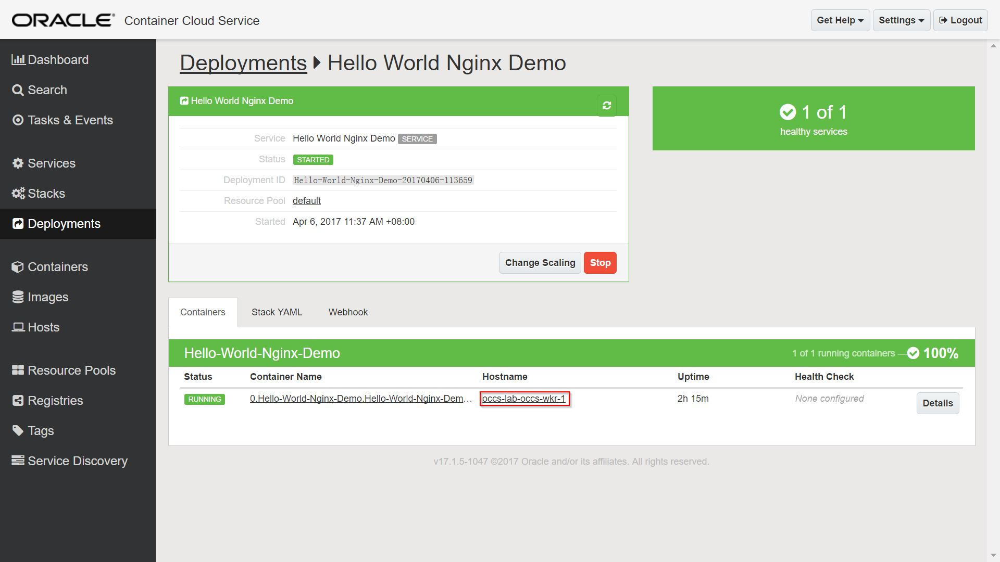

    세부적인 정보는 [Hosts](#hosts) 참조

-   **Stack YAML** 확인

    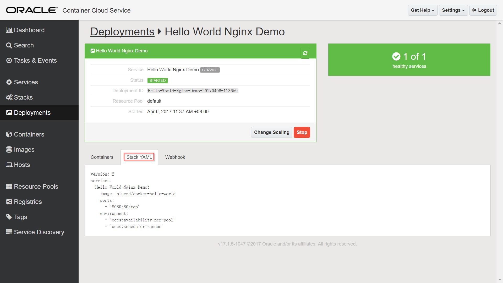

-   **Webhook** 확인

    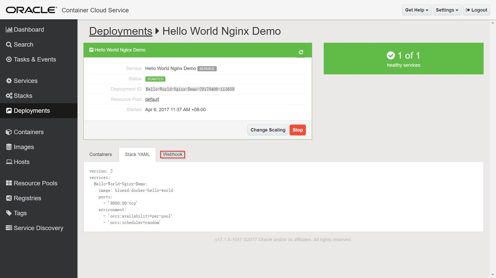

-   Deployment Pool 정보 확인, Pool 컬럼의 기본값 클릭.

    

    

>   자세한 내용은 [Resource Pools](#resource-pools) 참조

Containers
----------

### Descript**i**on

컨테이너 패널은 서비스 또는 스택을 배포 할 때 시작된 Docker 컨테이너를 관리하고
모니터링하고 실행중인 컨테이너의 로그 파일을 보는 데 사용됩니다.

Docker 컨테이너는 Docker 이미지에 보관 된 Application을 실행하기 위해 만든
프로세스입니다.

Docker 컨테이너에는 실행 코드, 런타임 환경, 시스템 도구 및 시스템 라이브러리를
비롯하여 응용 프로그램이 실행하기 위해 필요한 모든 것이 포함되어 있습니다. 이
컨테이너 화 된 접근 방식은 응용 프로그램이 실행되는 환경에 관계없이 응용
프로그램이 항상 동일하게 실행되도록합니다.

운영자가 Docker 실행 명령을 실행하면 실행되는 컨테이너 프로세스는 자체 파일
시스템, 자체 네트워킹 및 호스트와 별개의 격리 된 프로세스 트리가 있다는 점에서
분리됩니다.

### Operation

-   컨테이너를 Pause/Stop.

    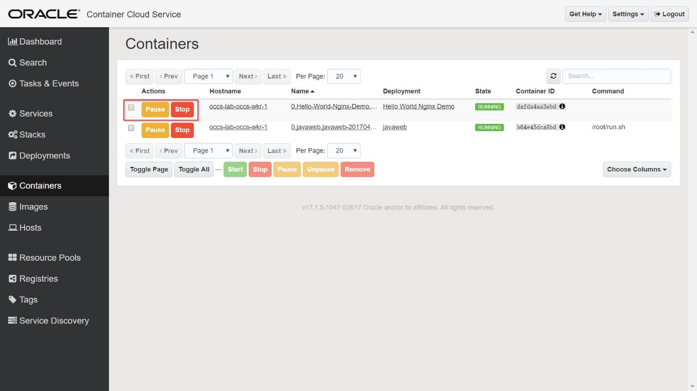

-   호스트 정보보기

    

    세부사항은 [Hosts](#hosts) 참조

-   Deployments 보기

    

    자세한 내용은 [Deployments](#deployments) 참조

-   Container 세부사항 보기

    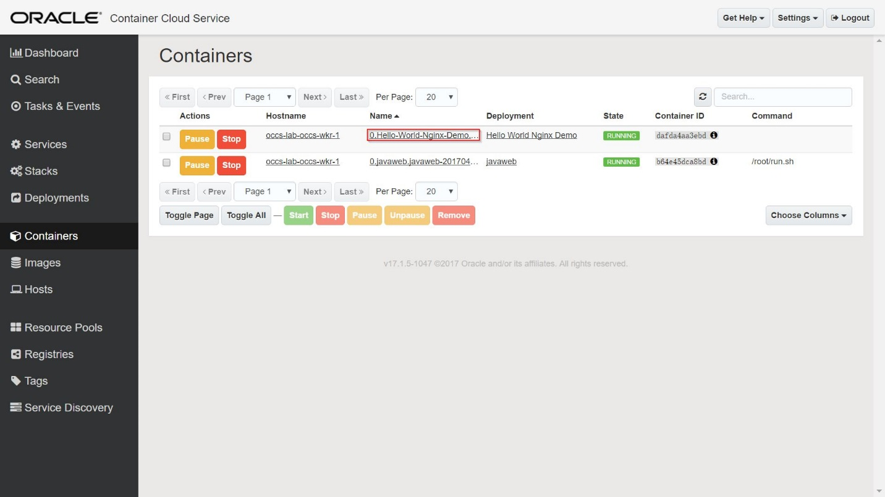

    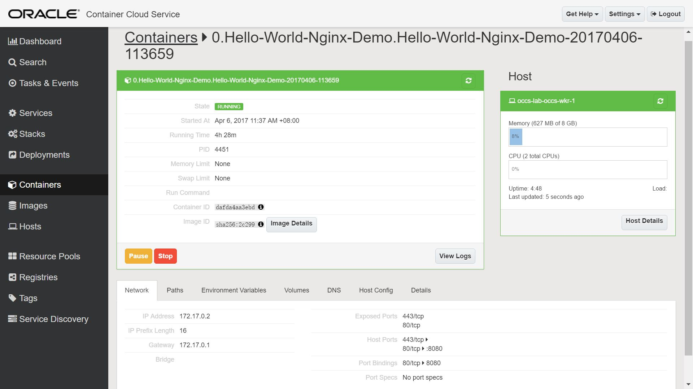

    -   Pause/Stop

        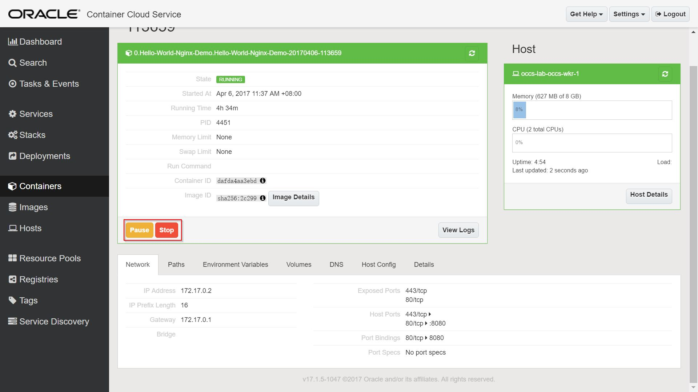

    -   네트워크, 경로, 환경 변수, 볼륨, DNS, Host Config 등 세부 사항 확인

        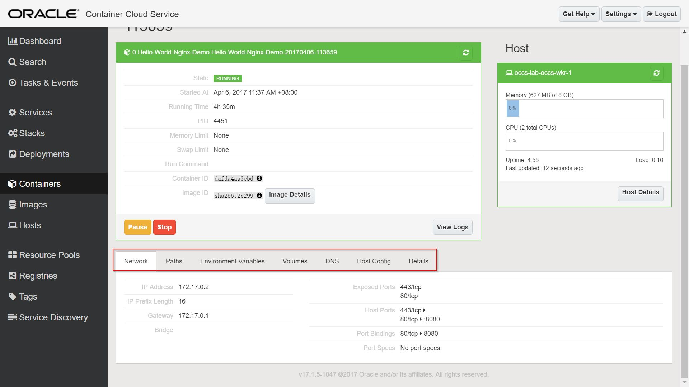

Images
------

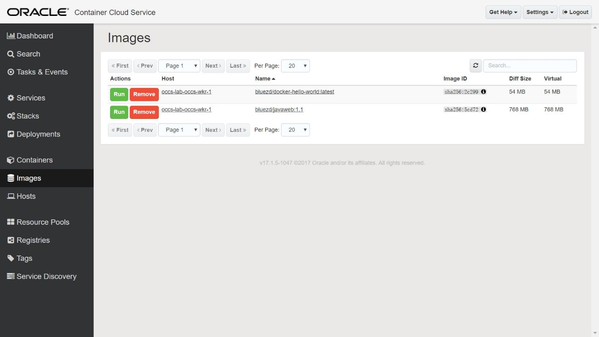

### Description

이미지 패널은 공개 또는 개인 Docker 레지스트리에서 가져온 Docker 이미지를
관리하고 이미지에서 컨테이너를 직접 시작하는 데 사용됩니다.

Docker 이미지에는 종속성과 함께 Docker를 실행할 Application이 있습니다. Docker
이미지는 Docker 레지스트리에 저장됩니다.

처음으로 서비스가 배포 될 때 (단독으로 또는 스택의 일부로) 서비스에 대한 Docker
이미지가 지정된 Docker 레지스트리 (공용 Docker 레지스트리 또는 개인 Docker
레지스트리)에서 가져와 서비스에 추가됩니다. Oracle Container Cloud Service에서
관리하는 이미지 목록. 다음과 같은 경우 Oracle Container 클라우드 서비스가
관리하는 이미지 목록에 동일한 Docker 이미지가 여러 번 나타날 수 있습니다.

-   이미지를 기반으로 하는 서비스가 여러 호스트에 배포됩니다.

-   이미지에 여러 개의 태그가 연결되어 있습니다.

Docker 레지스트리에서 Oracle Container Cloud Service가 관리하는 호스트로
이미지를 가져 오면 서비스를 배치하여 컨테이너를 시작하는 대신 이미지에서 직접
컨테이너를 시작할 수도 있습니다. 이러한 방법으로 이미지를 실행하면 Oracle
Container Cloud Service Container Console을 사용하여 컨테이너에 대한 옵션을
지정하고 컨테이너를 직접 관리 할 수 ​​있습니다. 이 경우 Oracle Container Cloud
Service는 실행중인 컨테이너에 대한 배포 객체를 생성하지 않습니다

### Operation

-   이미지 **Run/Remove**

    

-   Host 정보 확인

    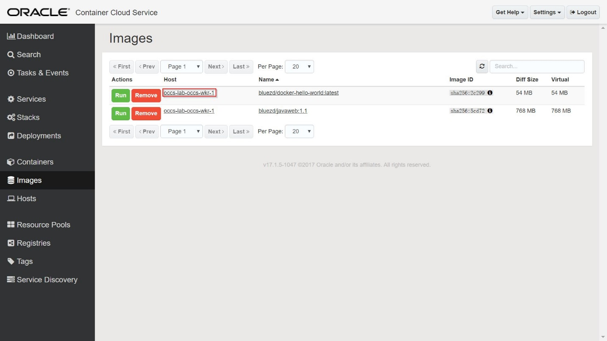

    세부사항은 [Hosts](#hosts) 참조

-   이미지 세부 정보 확인

    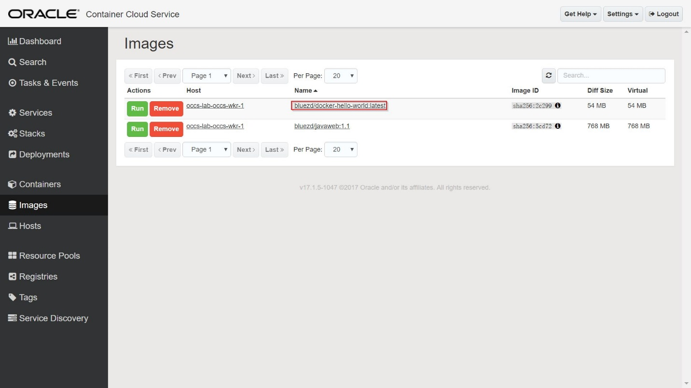

    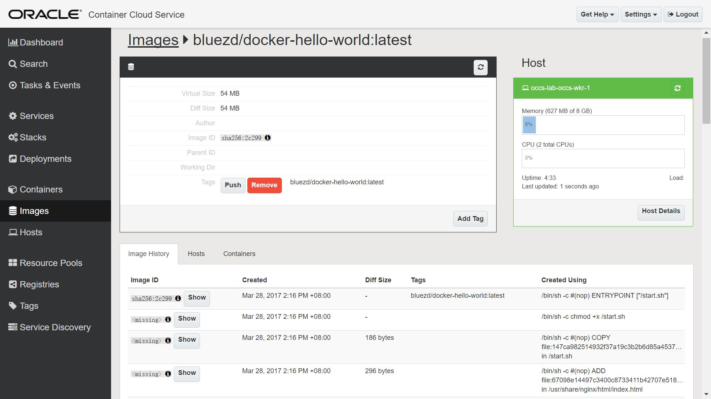

    -   TAG 푸쉬

        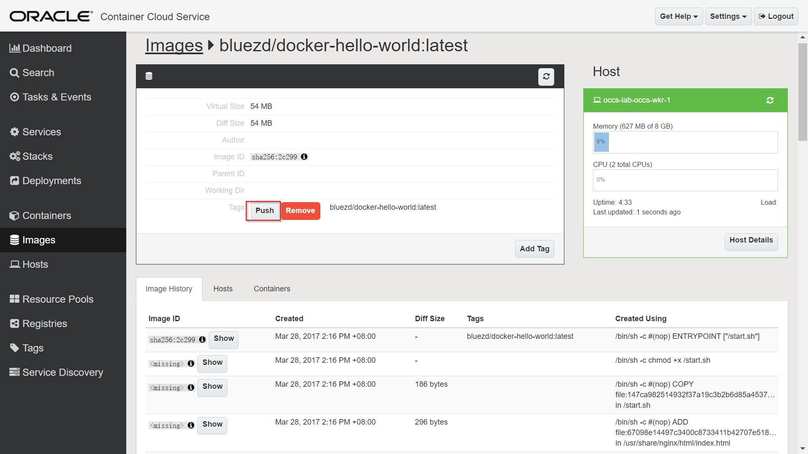

    -   이미지 제거

        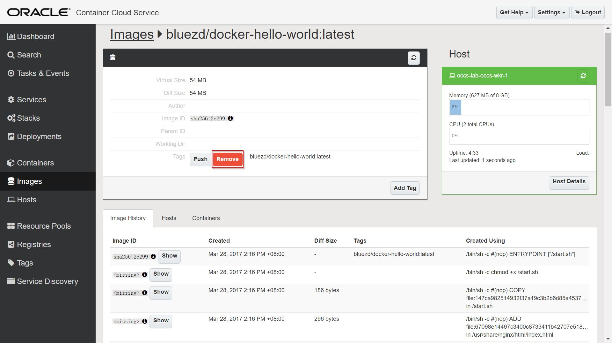

    -   Host 세부 정보

        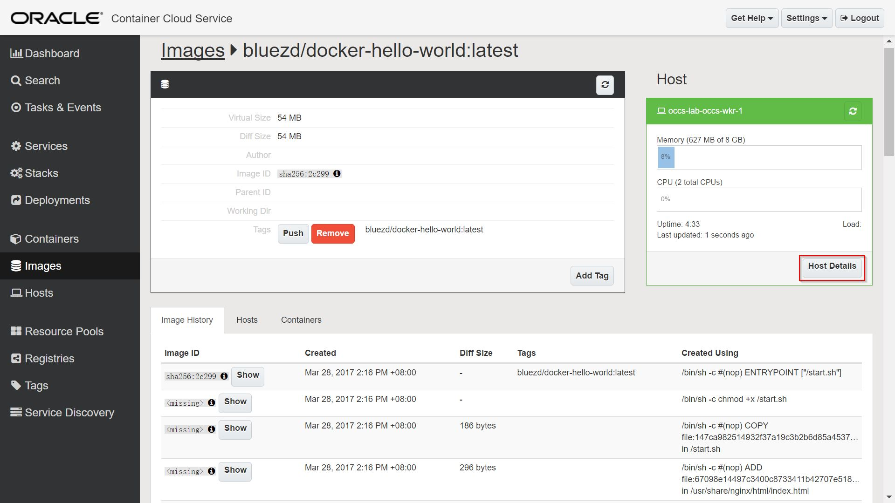

        

        세부 사항은 [Hosts](#hosts) 를 참조하십시오.

    -   컨테이너 정보

        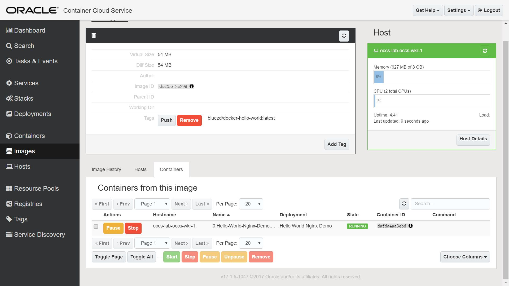

        자세한 내용은 [Containers](#containers) 를 참조 하십시오.

Hosts
-----

### Description

호스트 패널은 배포된 서비스 및 Stack에 대한 컨테이너를 실행중인 Oracle Compute
가상 시스템 (‘worker nodes’) 의 상태를 모니터링하고 리소스 풀간에 호스트를
이동하는 데 사용됩니다.

호스트(또는 ‘worker nodes’)는 Docker 컨테이너를 실행하기 위해 서비스 및 스택을
배포하는 Oracle Container Cloud Service에서 관리하는 Oracle Compute 가상 시스템
(VM)입니다.

모든 Oracle Container Cloud Service 인스턴스에는 하나의 관리자 노드와 여러
작업자 노드 (the \`hosts\`). 가 있습니다. Oracle Container Cloud Service 관리자
노드에서 실행되는 Oracle Container Cloud Service 소프트웨어는 인스턴스의 작업자
노드에 대한 Docker 컨테이너 배포를 조정합니다. 각 작업자 노드(Worker node)는
Docker 상태를 관리자 노드와 주고받는 Oracle Container Cloud Service 에이전트를
실행합니다.

에이전트가 관리자 노드와 성공적으로 통신 할 수 있으면 작업자 노드가 활성 상태 인
것으로 간주됩니다. 관리자 노드와 작업자 노드의 에이전트 사이의 통신이 1 분 이상
(네트워크, 하드웨어 또는 소프트웨어 문제로 인해) 손실되는 경우 작업자 노드는
비활성 상태 인 것으로 간주됩니다.

사용 가능한 호스트를 리소스 풀로 구성하여 일반적으로 사용량이나 목적을 공유하는
호스트를 함께 그룹화하여 워크 플로를 수용 할 수 있습니다. 호스트는 한 번에
하나의 리소스 풀만 존재할 수 있습니다.

Oracle Container Cloud Service Container Console을 사용하여 호스트 (활성 또는
비활성)의 런타임 상태를 모니터링 할 수 있습니다. 또한 컨테이너 콘솔을 사용하여
호스트에서 실행중인 컨테이너와 호스트로 다운로드 한 이미지를 관리하고 리소스
풀간에 호스트를 이동합니다

### Operation

-   **Hostname** 클릭

    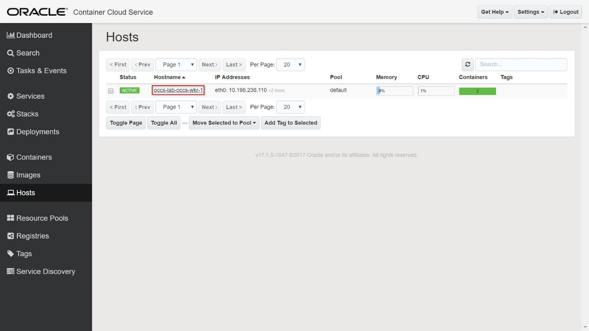

    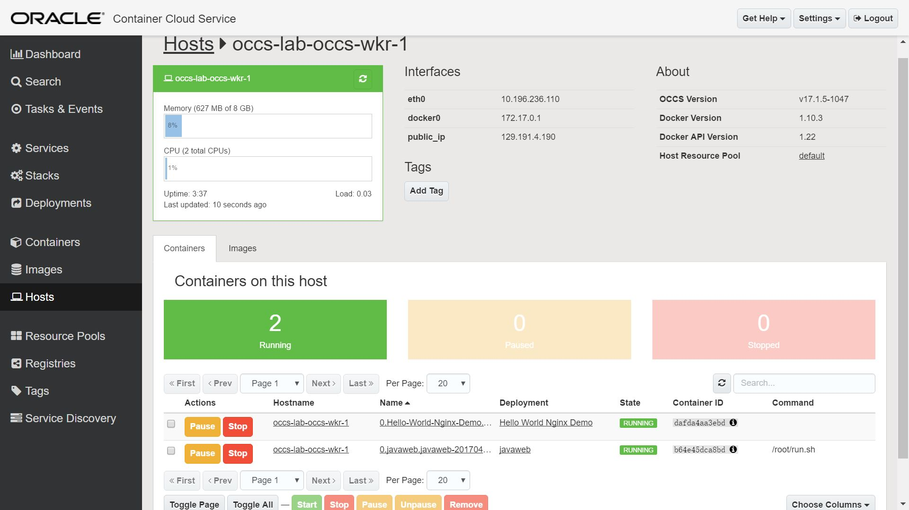

    호스트 세부 정보에서 다음 작업을 수행하십시오.

    -   컨테이너 중지

        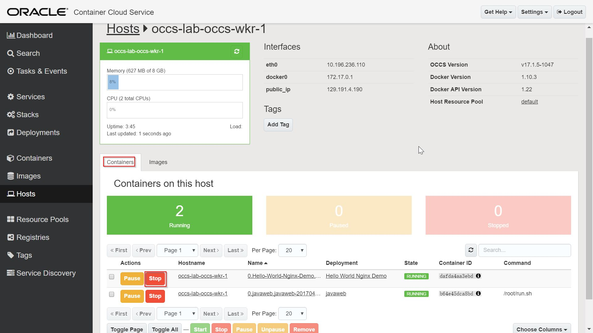

    -   컨테이너 정보를 확인하려면 컨테이너 이름을 클릭하십시오.

        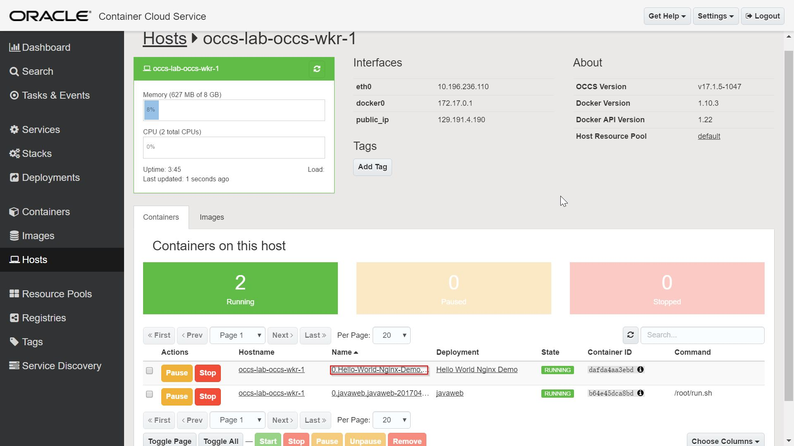

        

        자세한 사항은 [Containers](#containers) 를 참조 하십시오

    -   배포 정보 확인

        

        Detail see [Deployments](#deployments).

    -   **Images** 를 클릭하십시오.

        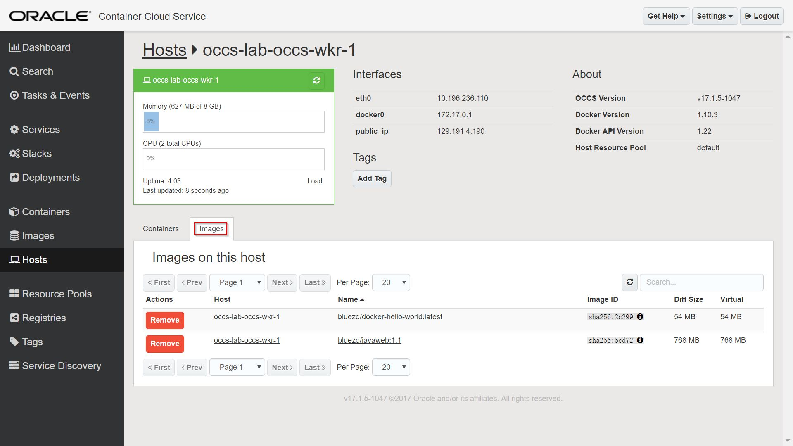

        -   **Remove** 를 클릭하여 image를 제거 하십시오

            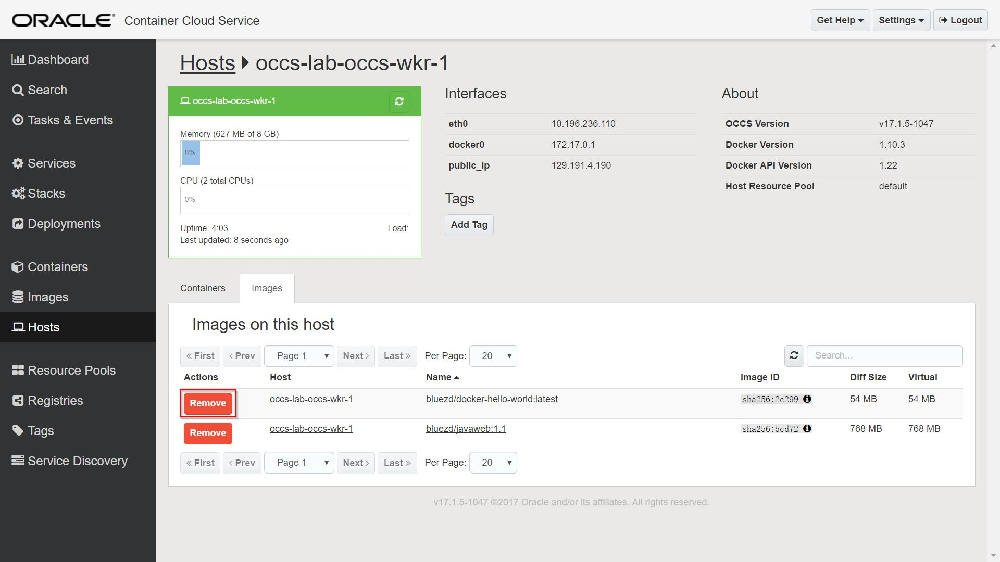

        -   이미지 이름을 클릭하면 이미지 세부정보를 볼 수 있습니다.

            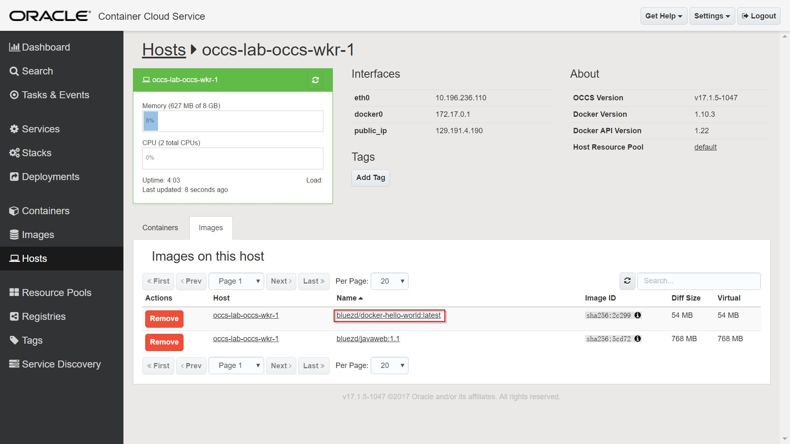

            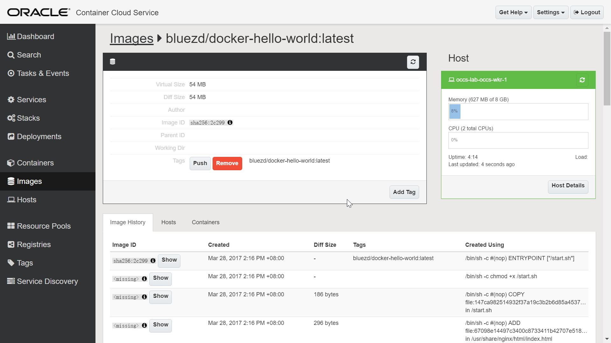

            자세한 내용은 [Images](#images) 를 참조하십시오.

-   **IP Address** 클릭 하십시오

    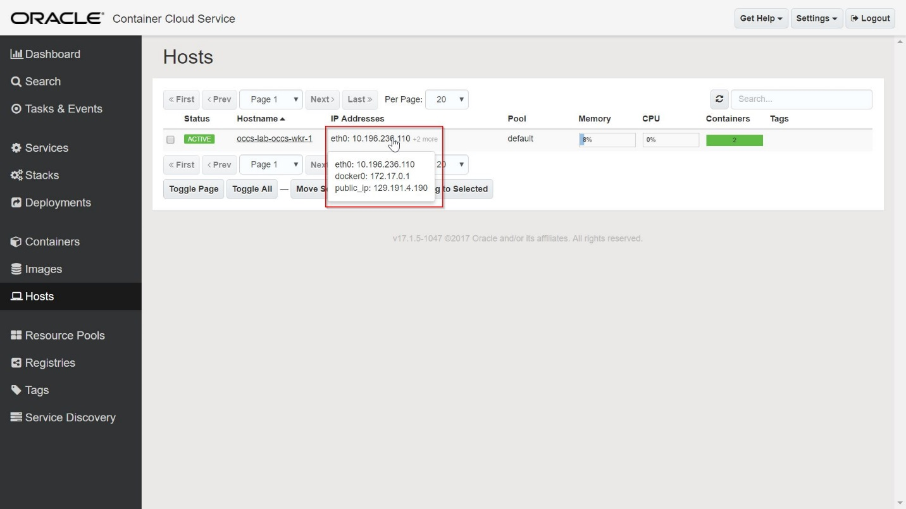

Resource Pools
--------------

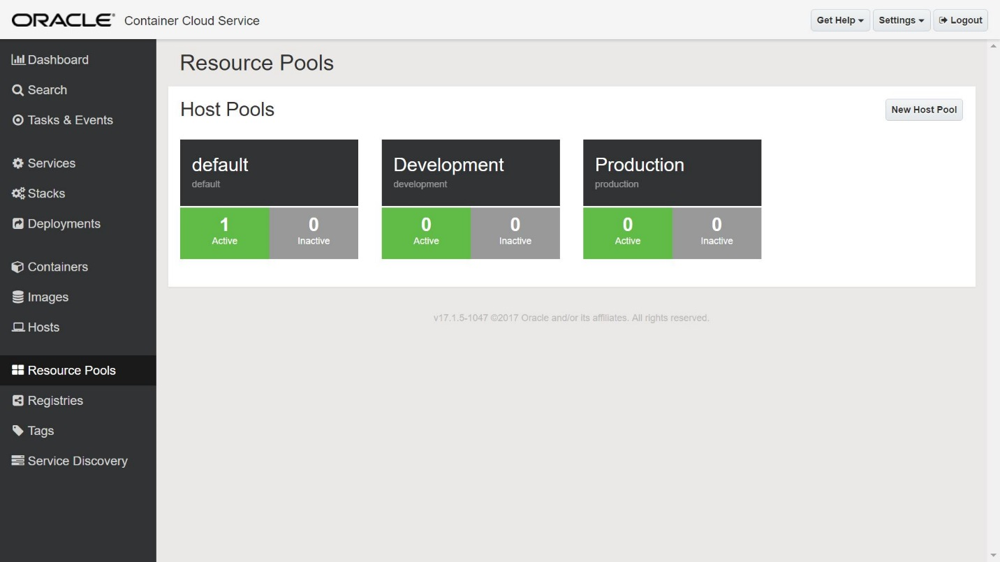

### Description

리소스 풀 패널은 핫을 구성하고이를 격리 된 컴퓨팅 리소스 그룹으로 결합하는 데
사용됩니다.

리소스 풀을 사용하면 서비스 및 스택을 여러 호스트에 효율적으로 배포하여 Docker
환경을보다 효율적으로 관리 할 수 ​​있습니다.

리소스 풀을 사용하면 사용법이나 목적을 공유하는 호스트의 그룹뿐만 아니라
지역성을 논리적으로 정의 할 수 있습니다.

호스트는 한 번에 하나의 리소스 풀에만 존재한다는 점에 유의해야합니다.

맨 먼저 정의된 세가지 리소스들이 있습니다.

-   default

-   Development

-   Production

기본 자원 풀의 이름은 임의적입니다. 이러한 풀의 이름을 바꾸거나 삭제할 수
있습니다. 중요한 것은 리소스 풀을 사용하여 워크 플로를 수용 할 수 있도록
호스트를 구성하는 것입니다.

### Operation

-   **Default** Pools을 클릭 하십시오.

    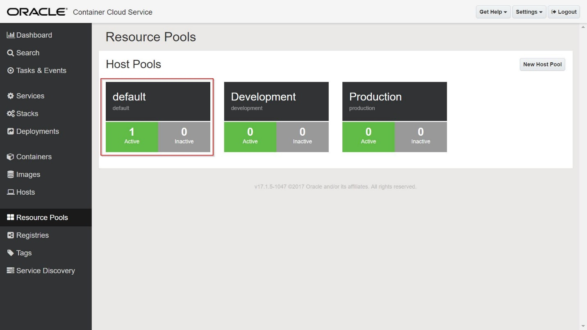

    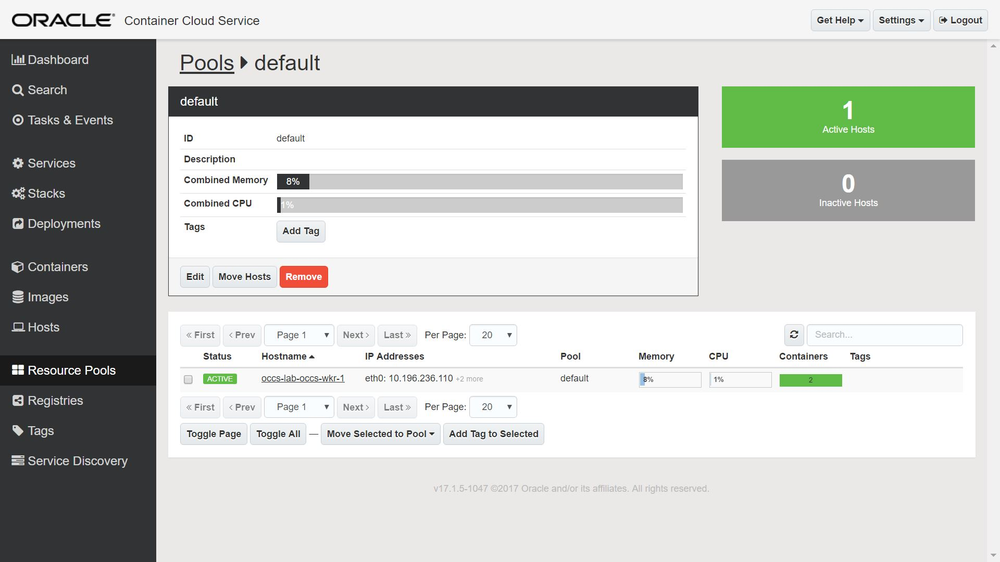

    -   Edit/Move Hosts/Remove/Add Tag:

        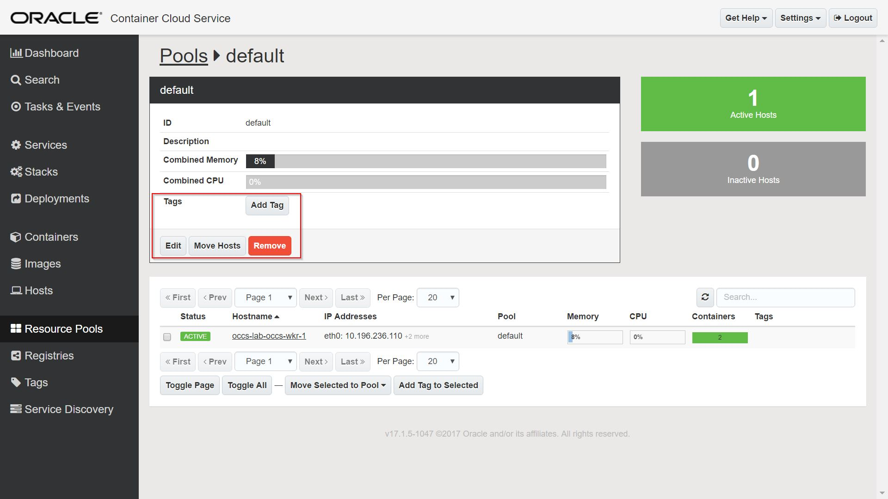

    -   Host 정보를 확인 하십시오.

        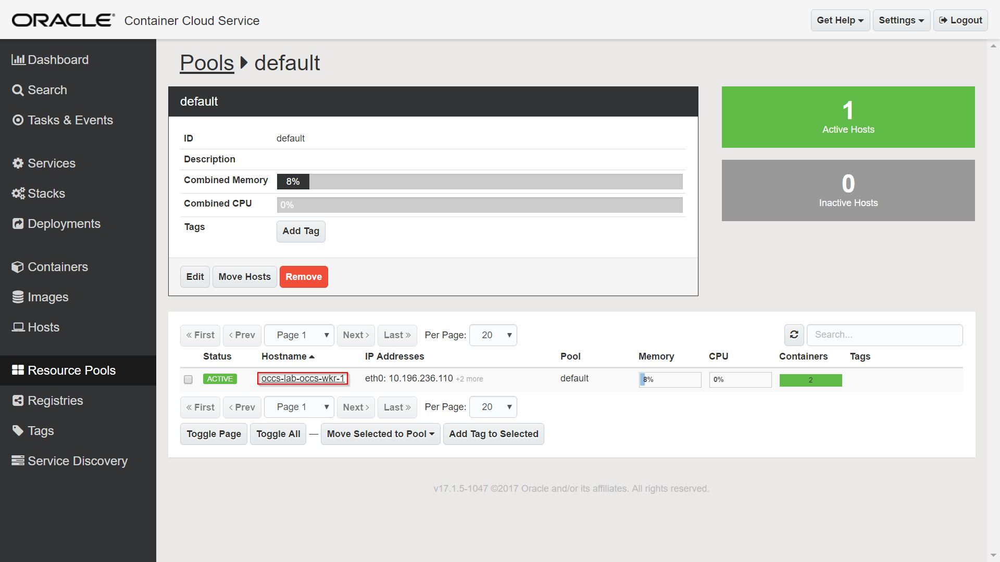

        세부 사항은[Hosts](#hosts) 를 확인 하십시오.

Registries
----------

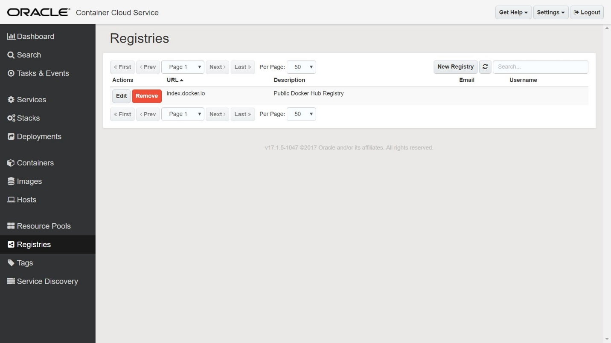

### Description

레지스트리 패널은 Oracle Container Cloud Service가 Docker 이미지를 가져 오게 할
공용 또는 개인 Docker 레지스트리를 정의하는 데 사용됩니다.

Docker 레지스트리는 Docker 이미지의 태그 버전을 저장하고 공유하기위한
시스템입니다. Docker 레지스트리는 명명 된 리포지토리로 구성됩니다. 각 Docker
저장소는 하나 이상의 이미지의 특정 버전과 연관됩니다.

Oracle Container Cloud Service는 Docker 이미지를 기반으로 서비스를 배포하기 전에
이미 이미지를 가져올 Docker 레지스트리 위치를 알고 있어야합니다. Oracle
Container Cloud Service가 이미지를 가져올 각 Docker 레지스트리에 위치 정보가
포함 된 레지스트리 정의가 있어야합니다.

Oracle Container Cloud Service에는 공용 Docker Hub 레지스트리에 대한 정의가
기본적으로 제공되므로 공개 이미지를 바로 시작할 수 있습니다. 그러나 Oracle
Container Cloud Service가 이미지를 가져 오게하려는 다른 공용 또는 개인
레지스트리에 대한 레지스트리 정의를 작성해야합니다.

### Operation

-   레지스트리 제거

    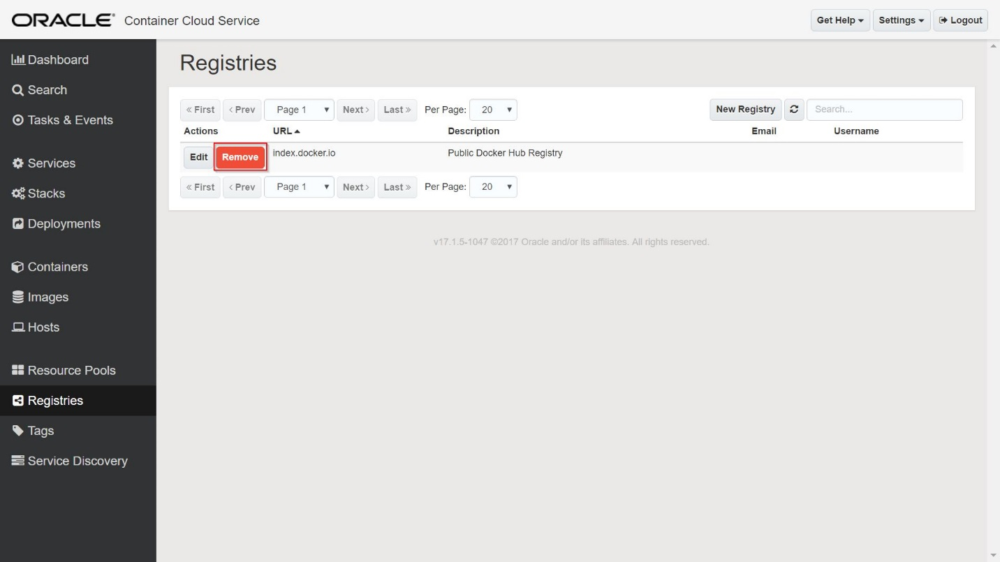

-   레지스트리 편집

    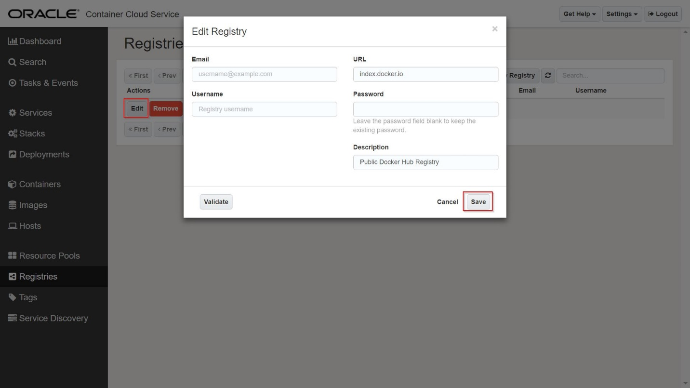

Tags
----

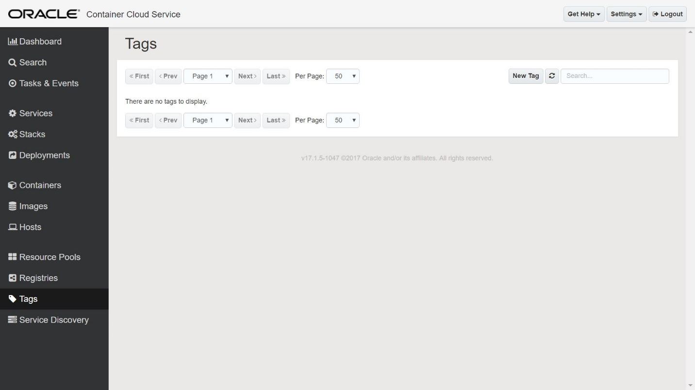

### Description

태그 패널은 자원 그룹과 그 안에있는 호스트를 분류하고 구성하는 데 사용됩니다.

Oracle Container Cloud Service 태그는 자원 풀 및 그 내부의 호스트를 분류 및
구성하여 Docker 환경을보다 효과적으로 관리 할 수있는 방법입니다.

오케스트레이션 정책을 정의 할 때 태그는 리소스 풀의 어느 호스트에서 서비스 또는
스택을 배포 할지를 세부적으로 제어합니다.

새 태그를 만들었 으면 다음과 같이 사용할 수 있습니다.

-   리소스 풀 용

-   호스트가 서비스를 배포 할 수있는 여러 호스트를 집합 적으로 식별

-   배포의 경우 서비스의 기본 오케스트레이션 세부 정보를 재정의하고 서비스를
    실행할 호스트를 지정합니다.

리소스 풀과 호스트를 구성하는 데 사용하는 태그는 Docker 이미지를 리포지토리에
푸시 할 때 사용하는 태그와 완전히 관련이 없습니다.

### Operation

-   **New Tag** 를 만듭니다.

    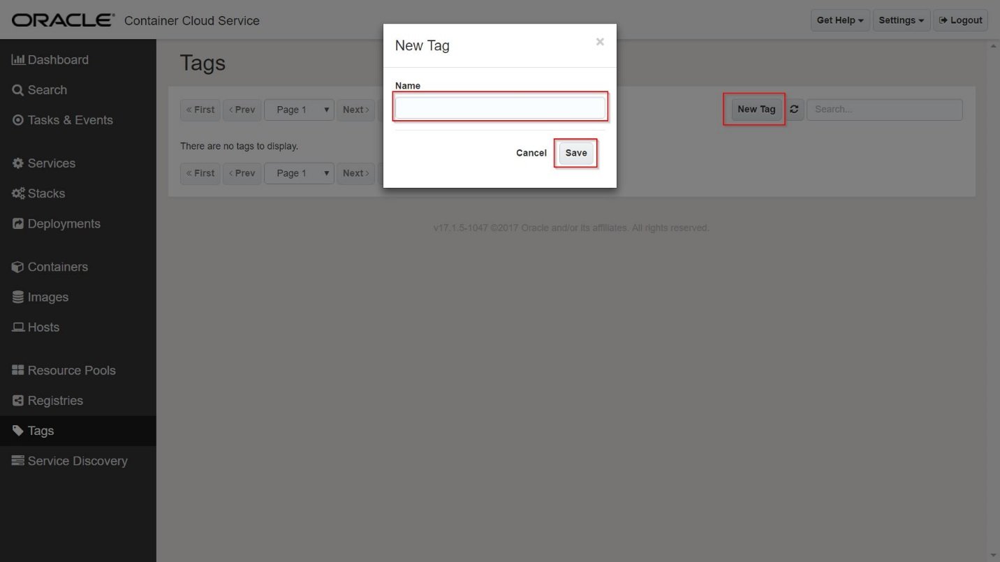

Service Discovery
-----------------

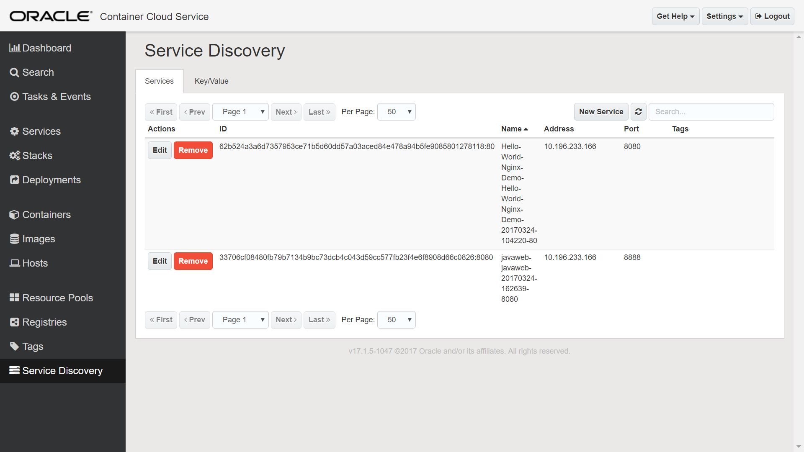

### Description

서비스 검색 패널은 실행중인 컨테이너가 서로 통신 할 수 있도록 Service Discovery
데이터베이스에서 서비스 DNS 정보를보고, 업데이트하고 추가하는 데 사용됩니다.

서로 통신하려면 Docker 컨테이너에 DNS 정보가 있어야 다른 컨테이너의 위치를 ​​찾을
수 있습니다. Oracle Container Cloud Service는 Service Discovery 데이터베이스에서
관리중인 실행중인 컨테이너에 대한 DNS 정보를 유지 관리합니다.

하나의 Docker 컨테이너에서 실행되는 서비스는 동일한 호스트 또는 다른 호스트의
다른 컨테이너에서 실행중인 두 번째 서비스에 종속 될 수 있습니다. 마찬가지로 여러
컨테이너가 로드 밸런싱 및 고 가용성 이유로 동일한 호스트 또는 다른 호스트에서
동일한 서비스를 실행 중일 수 있습니다. 이러한 상황에서 컨테이너는 DNS 정보를
사용하여 서로 통신합니다.

새 컨테이너가 시작되면 Oracle Container Cloud Service는 새로운 컨테이너의 IP
주소와 포트 번호를 Service Discovery 데이터베이스에 자동으로 등록합니다. 경우에
따라 Service Discovery 데이터베이스에 DNS 정보를 수동으로 입력하거나 업데이트 할
수 있습니다 (예 : 컨테이너를 처음 부트 스트랩하는 경우).

Service Discovery 데이터베이스의 각 컨테이너에 대한 레코드는 다음과 같습니다.

-   배포 된 컨테이너에 대해 생성 된 고유 ID로 구성된 키이며 배포 된 서비스의 ID
    및 이름과 연결됩니다 .

-   컨테이너가 실행중인 호스트의 IP 주소로 구성된 값이며 서비스에 의해 노출 된
    포트와 연결됩니다.

실행중인 컨테이너가 의존하는 새로 시작된 컨테이너를 인식하도록하려면 스택에
종속성 이름이 들어있는 컨테이너 키에 대한 Service Discovery 데이터베이스를
폴링하는 수신기 역할을하는 기능을 포함시켜야합니다. 그런 다음이 코드는 일치하는
컨테이너에 대한 DNS 정보를 작성할 수 있습니다.이 정보는 다른 컨테이너에서
정기적으로 쿼리하여 종속 컨테이너에 대한 최신 정보를 얻을 수 있습니다. 일부
Oracle Container Cloud Service 예제 스택에는이 기능이 포함되어 있습니다. 자세한
내용은
[GitHub](https://github.com/oracle/docker-images/tree/master/ContainerCloud)
에서 예제 Stack을 빌드하는 방법에 대한 정보를 참조하십시오.

### Operation

-   Service Discovery 편집

    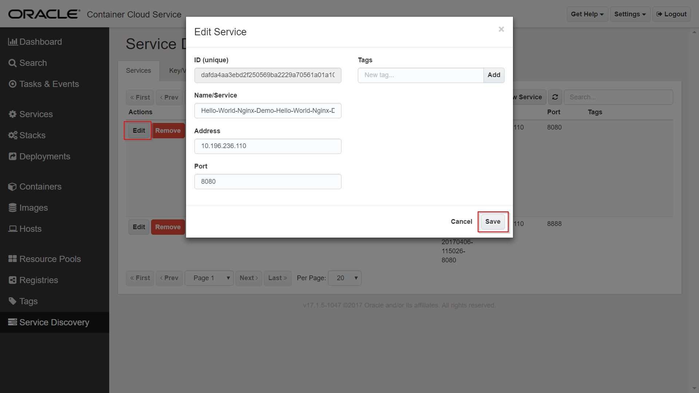

-   Service Discovery 제거

    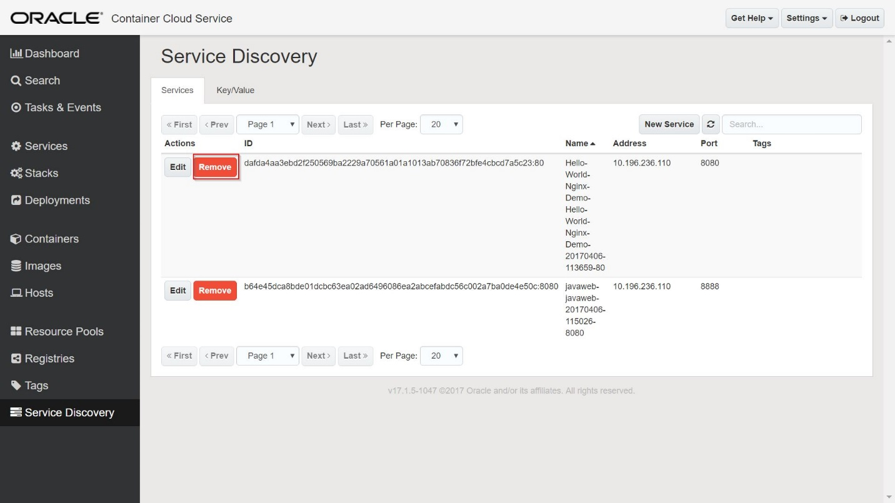
