Lab 300
============================

Container Cloud Service Hands-on Guide
======================================

*OCCS에 App 배포하기*
=================================

Introduction 
-------------

이 튜토리얼에서는 Oracle Container Cloud Service로 애플리케이션을 배치하는
방법을 보여줍니다.

Background:

-   GitHub의 프로젝트 소스 코드

-   GitHub에서 소스 파일이 업데이트 될 때마다 새 Docker 이미지를 자동으로
    빌드되도록 Docker Hub 설정

-   Oracle Container Cloud Service를 사용하여 Docker 이미지를 기반으로 Docker
    컨테이너로 새 서비스를 배포하십시오.

다음과 같은 두 가지 시나리오가 있습니다.

-   시나리오 1
    Nginx http 서버에서 실행되는 간단한 index.html

-   시나리오 2
    Nginx http 서버에서 실행되는 JET 프론트 엔드 프로젝트.

### Objectives

-   [GitHub](#scenario-1---fork-application-in-github)의 애플리케이션 Fork

-   [Docker Hub Automated
    Build](#scenario-1---create-a-docker-hub-automated-build) 생성

-   매뉴얼하게 빌드 트리거

-   [Oracle Container Cloud
    Service](#scenario-1---create-a-new-service-with-oracle-container-cloud-service)로
    새로운 서비스 생성

-   [Oracle Container Cloud
    Service](#scenario-1---deploy-the-new-service-with-oracle-container-cloud-service)를
    사용하여 새 서비스 배포

-   [첫번](#scenario-1---verify-the-first-deployment) 째 배포 확인

-   [GitHub](#scenario-1---modify-the-application-in-github)에서 Application
    수정

-   두 번째 배포 확인

### Required Artifacts 

Oracle Container Cloud Service를 사용하기 전에 다음을 수행하십시오.

GitHub 계정: 아직 계정이 없다면, go to <https://github.com/> 으로 이동하여
가입하십시오.

Docker Hub 계정: Docker Hub 계정이 없다면, go to
[https://hub.docker.com/](https://hub.docker.com/login) 을 방문하여
가입하십시오.

Scenario 1 - Fork application in GitHub
---------------------------------------

1.  아무 브라우저에서나, <https://github.com/login> 에서 GitHub 계정에 로그인
    하십시오

2.  Go to
    <https://github.com/oracle/docker-images/tree/master/ContainerCloud/images/docker-hello-world>
    이동하십시오.

3.  저장소 페이지의 상단에 있는 메뉴에서 Fork 버튼을 클릭하십시오.

    

>   이제 docker-images 저장소의 복사본을 만들었습니다.

Scenario 1 - Create a Docker Hub Automated Build
------------------------------------------------

1.  Docker 허브 계정( <https://hub.docker.com/login> )에 로그인 하십시오.

2.  Docker Hub **Create** 메뉴에서 “**Create Automated Build”** 를 선택
    하십시오.

    

3.  **Link Accounts** 를 클릭 하십시오

    

4.  **Link GitHub**를 클릭 하십시오.

    

5.  Public and Private 을 선택하고 **Select**를 클릭 하십시오.

    

6.  **Authorize application** 클릭하십시오

    

7.  confirm password를 입력 하십시오.

    

8.  Docker Hub **Create** 메뉴에서 **Create Automated Build**를 선택
    하십시오.

    

9.  여러분의 GitHub 계정에 명시된 **Create Auto-build GitHub**을 클릭하면 automated
    build를 생성할 저장소가 포함되게 됩니다.

    

10.  자신의 GitHub 계정으로 fork된 docker-images 저장소를 선택합니다.

    

11.  Automated build 생성 페이지에서 다음을 수행하십시오.

    a.  다음 값을 입력하십시오.
        i.  ** Name:** docker-hello-world
        ii.  ** Short Description:** Simple Hello World Example
    b.  ** Create** 클릭

    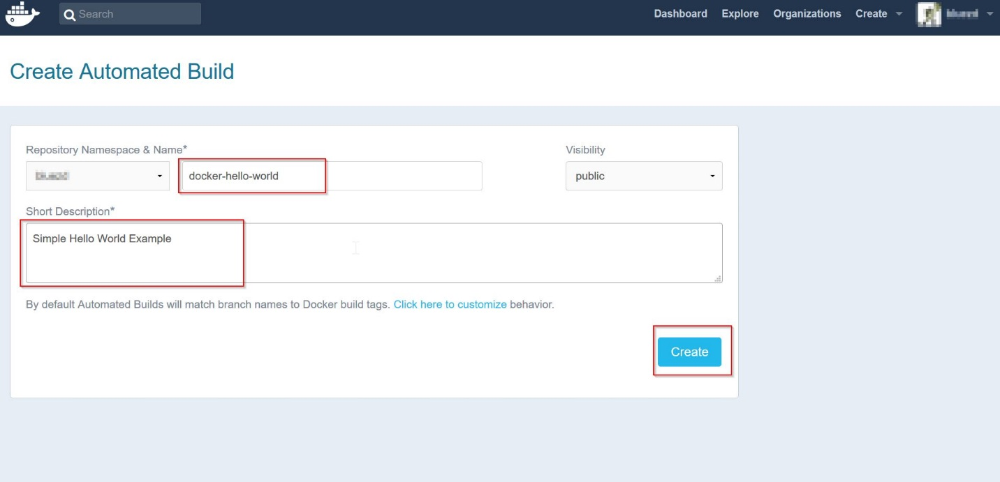

        Automated build 생성되면, Automated Build 화면의 **Repo Info**
        탭이표시됩니다. 

    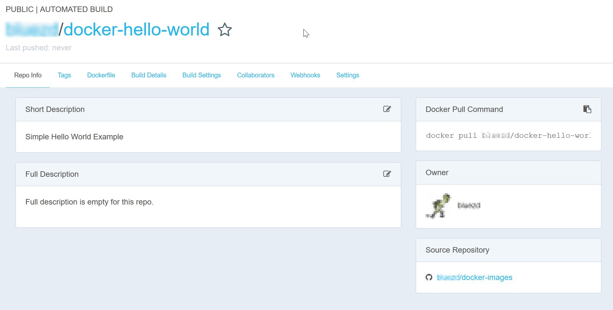

12.  **Build Settings** 탭으로 이동하십시오.

>   **Dockerfile Location** 필드의 값을
>   */ContainerCloud/images/docker-hello-world/* 로 변경 하십시오

    

>   **Build Settings** 탭에서 정의한 빌드 규칙은 이미지 작성 방법 및 시기를
>   지정합니다. 디폴트로 이미지들은 다음과 같습니다.

-   업데이트가 GitHub에 푸시 될 때마다 자동으로 생성됩니다.

-   마스터 GitHub 브랜치를 사용하여 빌드

-   저장소의 루트 디렉토리에 있는 Dockerfile의 마스터 빌드 규칙을 사용하여 빌드

-   Docker Hub에서 최신 태그를 받음

Scenario 1 - Trigger the Build Manually
---------------------------------------

docker-hello-world 앱의 변경 사항이 GitHub의 docker-images 저장소로 푸시 될
때마다 새로운 Docker 이미지가 빌드되도록 Docker 허브에 자동화 된 빌드를
설정했습니다. 또는 Docker Hub에서 수동으로 빌드를 트리거 할 수도 있습니다.

1.  **Build Settings** 탭에서 마스터 브랜치 옆의 **Trigge**를 클릭하여 기본 빌드
    설정으로 이미지를 빌드 하십시오.

    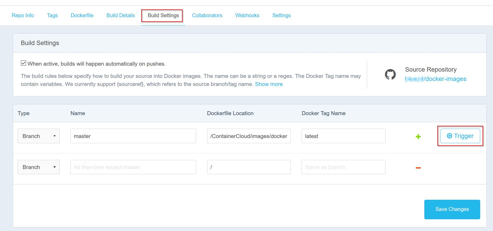

2.  Docker 허브 저장소의 **Build Details** 페이지로 이동하십시오.

    방금 트리거된 빌드가 **Build Details** 상에 나타납니다. 지정한 빌드 설정으로
    인해 이미지는 master GitHub 브랜치를 사용하여 빌드되며 Docker Hub에 최신
    태그가 제공됩니다.

    이미지가 성공적으로 빌드되면 Build Details 페이지가latest라는 태그로
    나타납니다.

    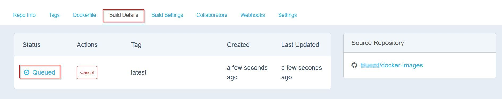

    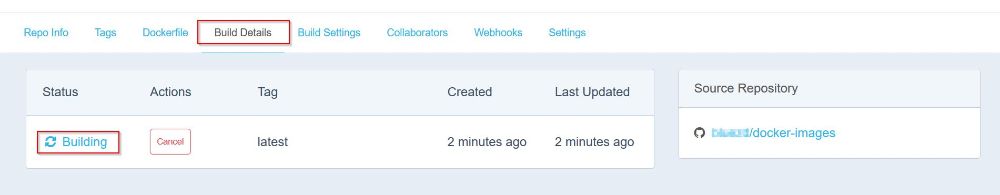

    

3.  **Repo Info** 탭으로 이동하십시오.

    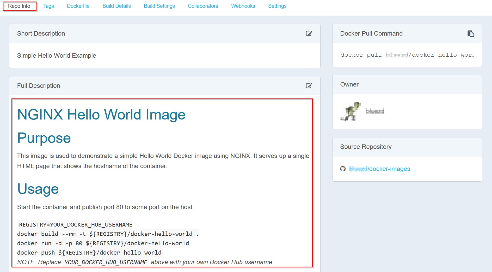

    이제 GitHub 저장소의 README.md 파일이 Docker 저장소의 **Full
    Description**필드에 포함되어 있음을 알 수 있습니다.

4.  **Dockerfile** 탭으로 이동하십시오.

    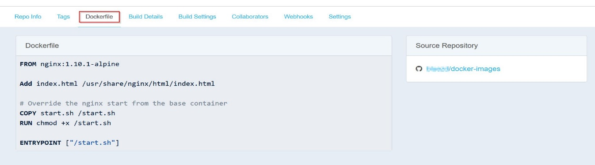

Scenario 1 - Oracle Container Cloud Service Console 에 접속
---------------------------------------------------------------------

1.  강사로 부터 부여 받은 IP를 이용하여 Console에 접속합니다.

    

2.  Services page에서, **New Service**를 클릭하여 Service Editor를 표시하고
    다음을 수행합니다.

    a.  다음 값을 입력 하십시오.

        i.  **Service Name:** Hello World Nginx Demo

        ii.  **Image:** YourAccount/docker-hello-world (Docker Hub 계정의 이미지)

        iii.  **Ports:** TCP 프로토콜을 사용하여 호스트 포트 8080에서 컨테이너
            포트 80으로 매핑을 설정합니다 (나중에 포트 8080을 사용하여 배포 된
            응용 프로그램이 실행 중인지 확인합니다)

    b.  **Save**를 클릭하여 새 서비스를 만들고 Service Editor를 닫습니다.

    

    

    

Scenario 1 - Deploy the New Service with Oracle Container Cloud Service
-----------------------------------------------------------------------

1.  컨테이너 콘솔의 서비스 페이지에서 방금 생성 한 Hello World Nginx Demo 서비스
    옆의 **Deploy** 버튼을 클릭 하십시오.

    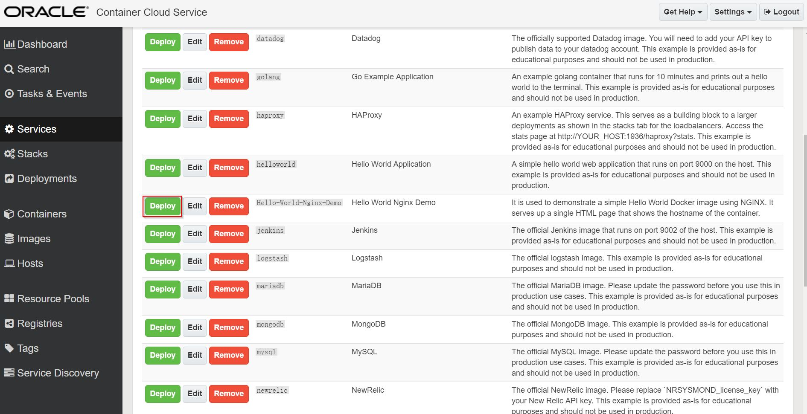

    다음에 대한 기본값을 포함하는 배포 대화 상자가 나타납니다.

-   배포 이름

-   배포를 실행할 Host pool

-   배포할 컨테이너 수 및 배포할 컨테이너를 선택하는 방법

    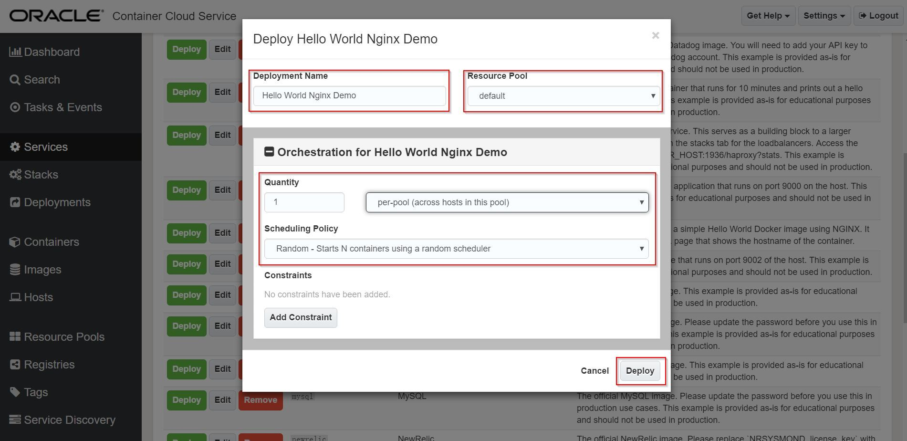

2.  Deployments 페이지가 나타나 방금 만든 배포의 진행 세부 정보가 표시됩니다.

    우선, Docker-hello-world 이미지가 Docker Hub에서 가져옵니다. 이미지를
    다운로드하면 컨테이너로 시작됩니다. Deployments 페이지는 컨테이너 상태를
    "Running"으로 표시하고 컨테이너가 실행중인 호스트의 이름을 표시합니다.

    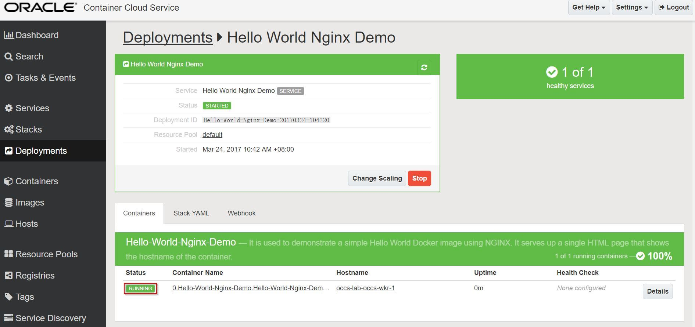

3.  **Hostname** 컬럼 안에 호스트 이름을 클릭하여 컨테이너가 실행중인 호스트의
    디테일한 내용을 보십시오.

    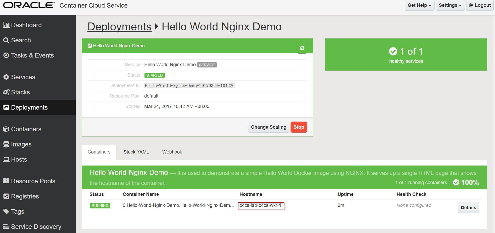

    Host페이지가 나타나 컨테이너를 실행중인 호스트의 디테일한 사항을 표시합니다.

4.  Host 페이지에서 **public_ip** 필드 값을 복사 하십시오.

    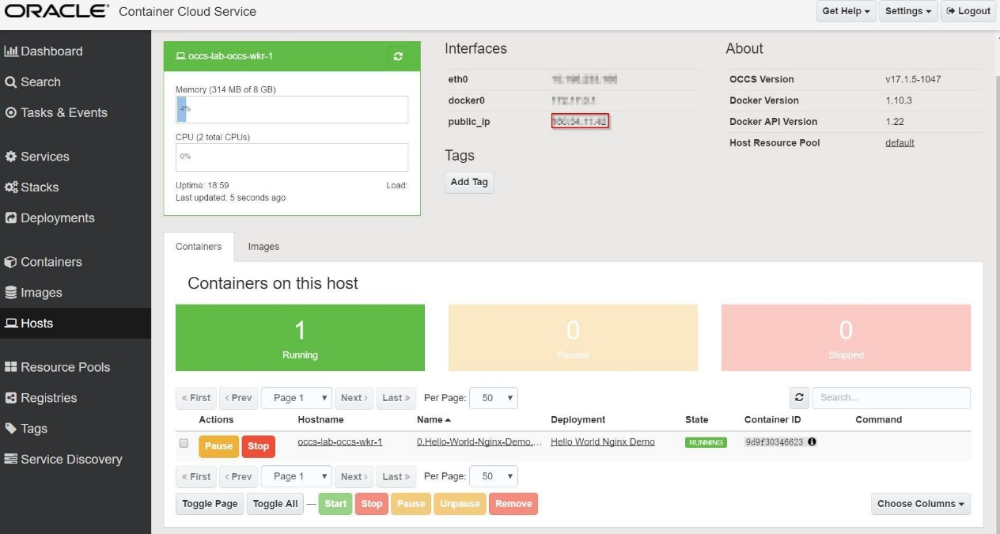

Scenario 1 - Verify the first Deployment
----------------------------------------

1.  새 브라우저 창을 엽니다.

2.  Running 중인 docker-hello-world 앱에 액세스할 수 있는 Hello World Nginx
    Demo컨테이너에서 형태로 실행되는 URL을 입력하십시오.

    -   \<public_ip\> 는 Host 페이지의 **public_ip** 필드에서 복사한 값입니다.

    -   8080은 이전에 컨테이너 포트 80에 매핑 한 호스트 포트입니다

        

        이제 Docker Hub에서 docker-hello-world 애플리케이션을 성공적으로
        구축하고 Oracle Container Cloud Service를 사용하여 실행중인 Docker
        컨테이너에 배포했습니다.

Scenario 1 - Modify the Application in GitHub
---------------------------------------------

1.  GitHub로 돌아가서 방금 Fork한 프로젝트를 엽니다.

    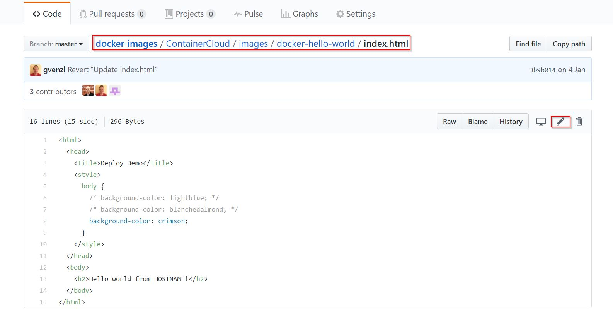

2.  아래와 같이index.html을 수정하십시오.

    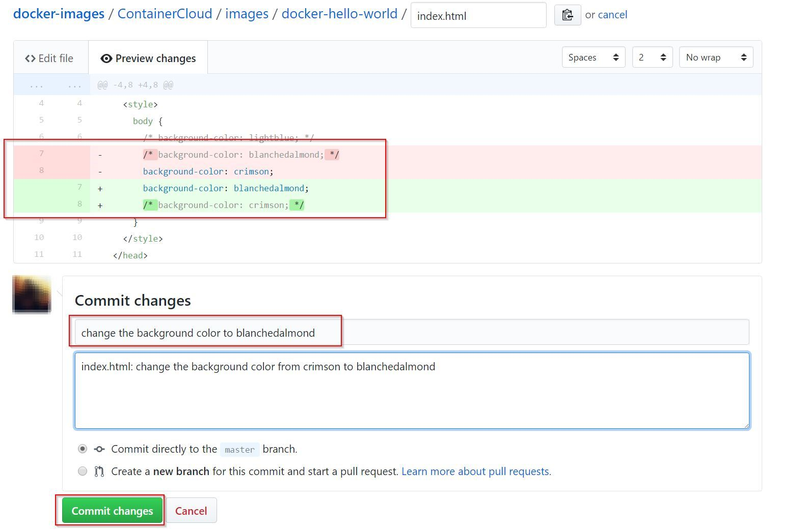

Scenario 1 - Verify the second Deployment
-----------------------------------------

1.  Docker Hub 로 이동- hello-world project 대시보드로 이동하여 Build Details를
    선택하십시오.

    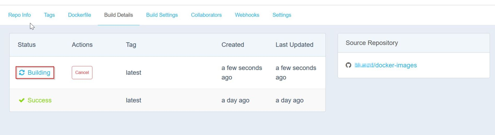

    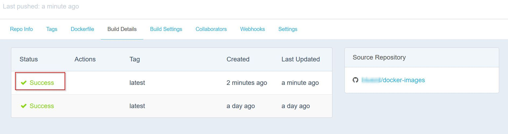

    Docker 이미지는 자동으로 작성됩니다.

2.  Oracle Container Cloud Service로 돌아가서 좌측 패널의 **Deployments**
    클릭하고 **Stop** 을 클릭하여 컨테이너를 중지합니다.

    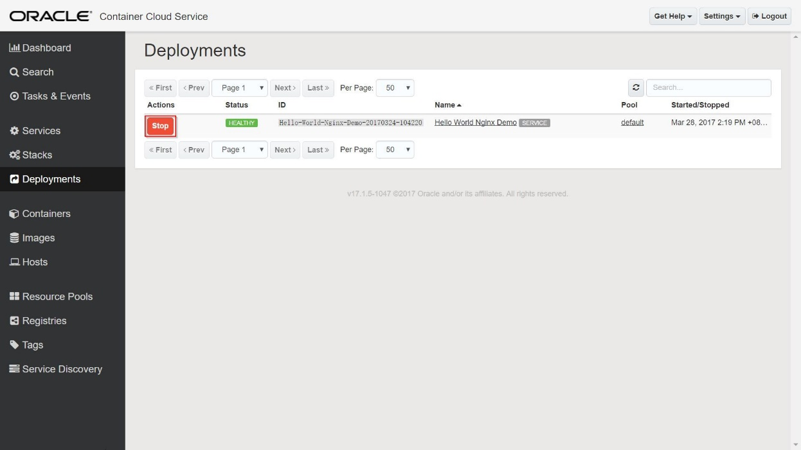

3.  컨테이너가 중지되었습니다. 시작을 클릭하여 다시 시작하십시오.

    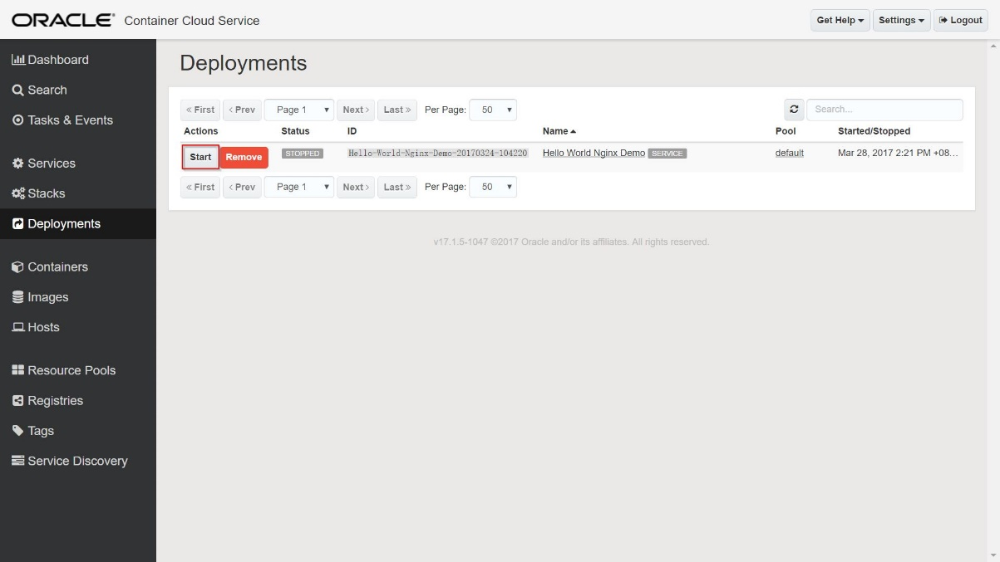

4.  서비스가 다시 시작되었습니다.

    DockerHub에서 최신 Docker 이미지 가져오기

    

5.  결과 확인, 새 브라우저 창 열기.

    Hello World Nginx Demo container 안에 Running중인 docker-hello-world 앱에
    액세스하기 위한 URL을 입력하시오. http://\<public_ip\>:8080

    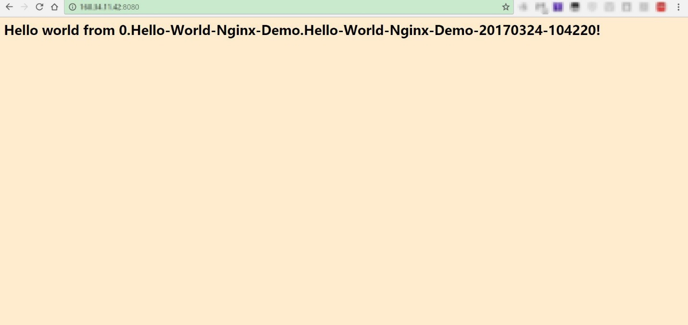

    index.html에서 배경을 수정하면 수정이 적용됩니다!

Scenario 2 - Fork application in GitHub
---------------------------------------

1.  아무 브라우저를 열어서, <https://github.com/login> 에서GitHub 계정에 로그인
    하십시오.

2.  <https://github.com/karthequian/jet-docker/tree/master/WorkBetter> 로
    이동하십시오.

3.  저장소 페이지의 상단에 있는 메뉴에서 **Fork** 버튼을 클릭하십시오.

    

Scenario 2 - Create a Docker Hub Automated Build
------------------------------------------------

1.  Docker 허브 계정 <https://hub.docker.com/login> 에 로그인 하십시오.

2.  Docker Hub Create 메뉴에서 **Create Automated Build**를 선택 하십시오.

    

3.  **Create Auto-build Github** 클릭

    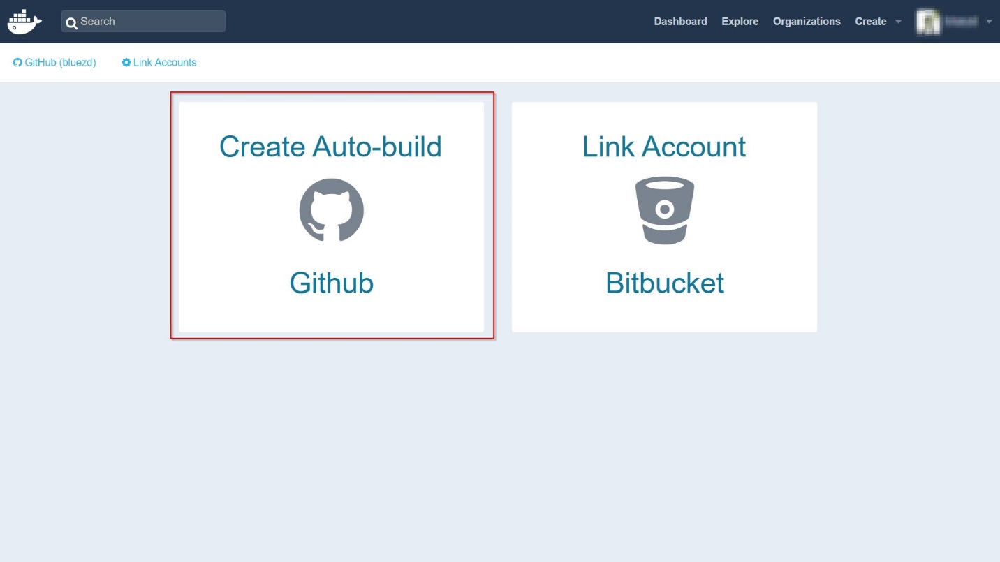

4.  자신의 GitHub 계정으로 fork된 **jet-docker** 저장소를 선택하십시오.

    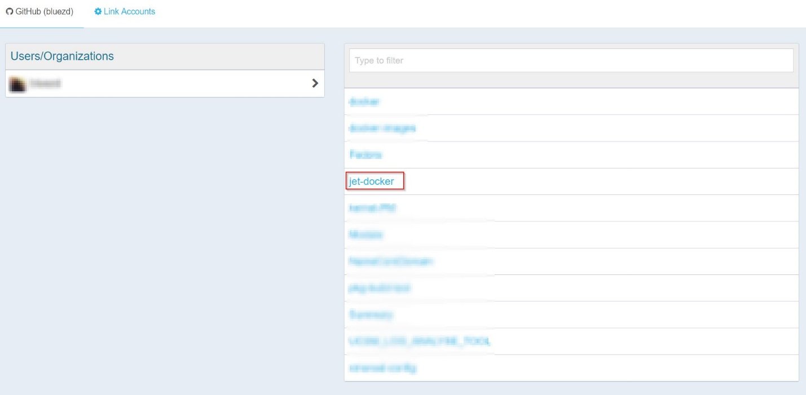

5.  Create Automated build 페이지에서 다음을 수행하십시오.

    a.  Name 과 Short Description 입력

    b.  **Create** 클릭

    

6.  **Build Settings** 탭으로 이동하십시오.

    **Dockerfile Location** 필드 값을 /WorkBetter/ 로 변경

    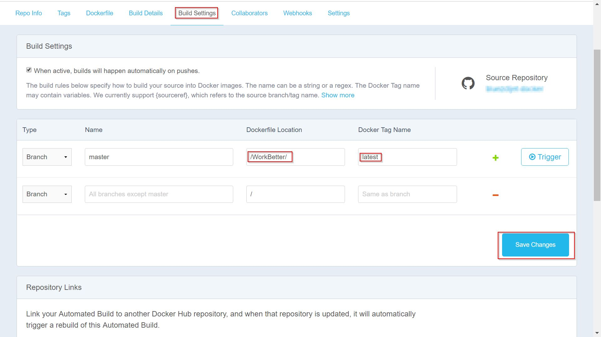

Scenario 2 - Trigger the Build Manually
---------------------------------------

Docker Hub에서 수동으로 빌드를 트리거 합니다.

1.  **Build Settings** 탭에서마스터 브랜치 옆의 **Trigger** 를 클릭하여 기본
    빌드 설정으로 이미지를 빌드하십시오.

    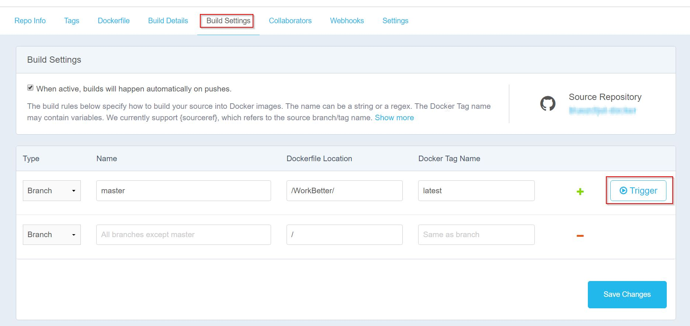

2.  Docker 허브 저장소의 **Build Details** 페이지로 이동하십시오.

    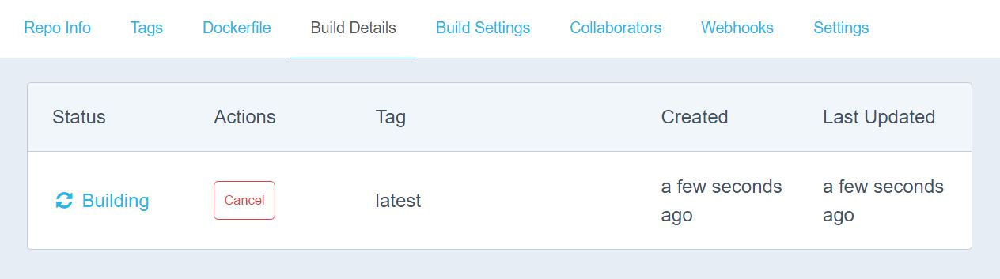

    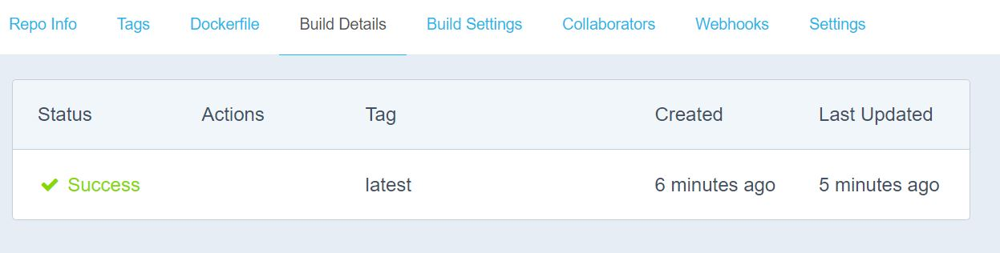

3.  **Repo Info** 탭으로 이동하십시오.

    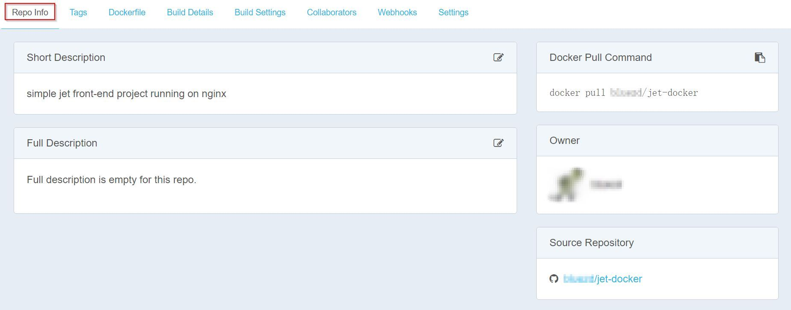

4.  **Dockerfile** 탭으로 이동하십시오.

    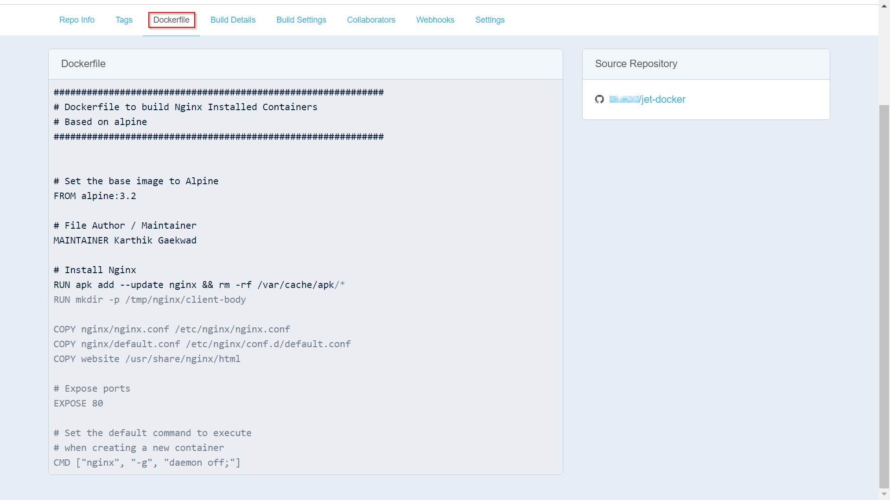

Scenario 2 - Create a New Service with Oracle Container Cloud Service
---------------------------------------------------------------------

1.  Services page에서, click **New Service** 클릭하여 Service Editor 표시하고
    다음을 수행합니다.

    a.  다음 값을 채우십시오.

        i.  **Service Name:** jetExample

        ii.  **Image:** YourAccount/jet-docker (Docker Hub 계정의 이미지)

        iii.  **Ports:** TCP 프로토콜을 사용하여 호스트 포트 9999에서 컨테이너
            포트 80으로의 매핑을 설정합니다 (나중에 배포 된 응용 프로그램이 실행
            중인지 확인하기 위해 포트 9999를 사용합니다)

    2.  **Save**를 클릭하여 새 서비스를 만들고 Service Editor를 닫습니다.

    

    

    

Scenario 2 - Deploy the New Service with Oracle Container Cloud Service
-----------------------------------------------------------------------

1.  Container 콘솔의 서비스 페이지에서, 방금 생성한 jetExample 서비스 옆에 있는
    **Deploy** 버튼을 클릭합니다.

    

    다음에 대한 기본값을 포함하는 배포 대화 상자가 나타납니다.

-   배포 이름

-   배포를 실행할 Host pool

-   배포할 컨테이너 수 및 배포할 컨테이너를 선택하는 방법

    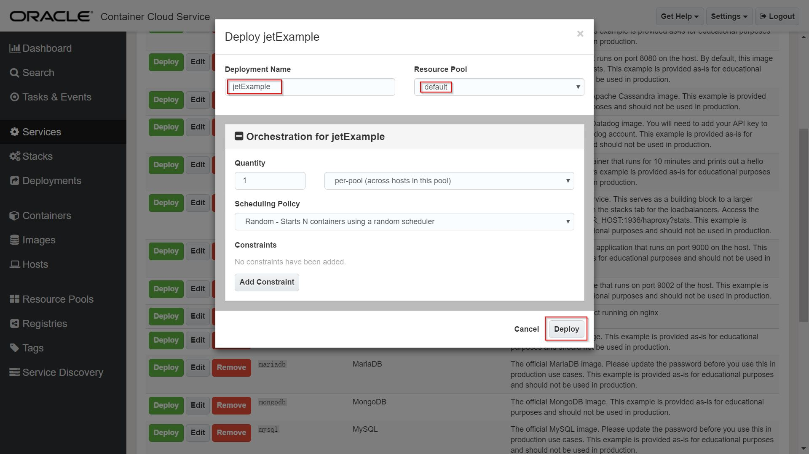

    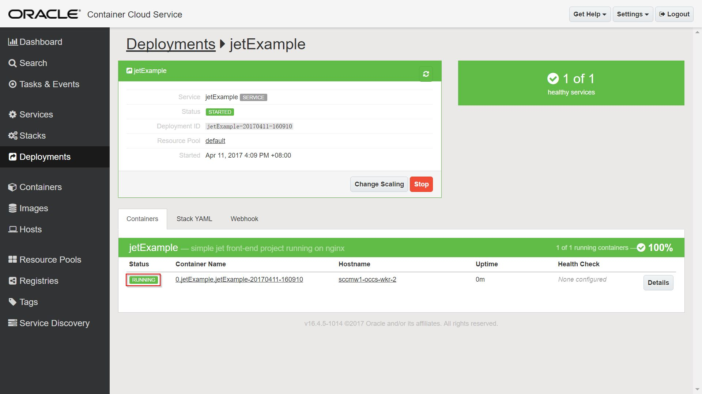

2.  Click on the name of the host in the **Hostname** 컬럼에서 호스트의 이름을
    클릭하여 컨테이터를 실행중인 호스트의 디테일한 사항을 보십시오.

    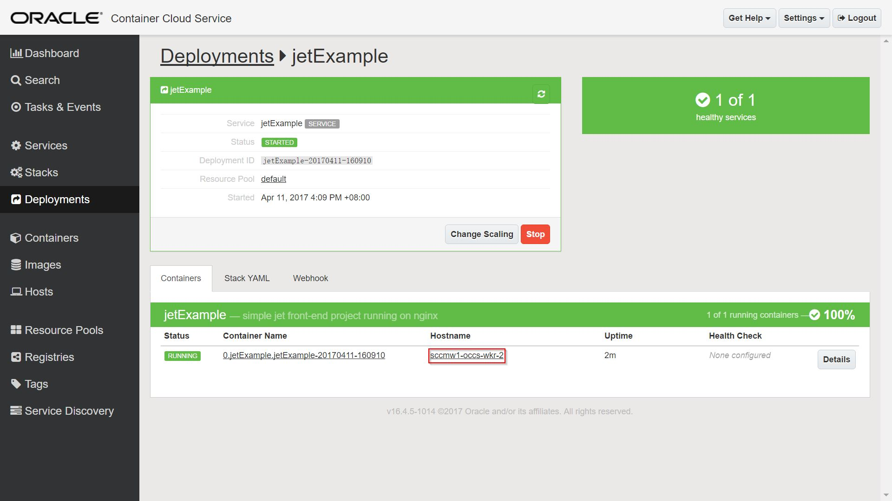

3.  Host 페이지에서 **public_ip** 필드의 값을 복사 하십시오.

    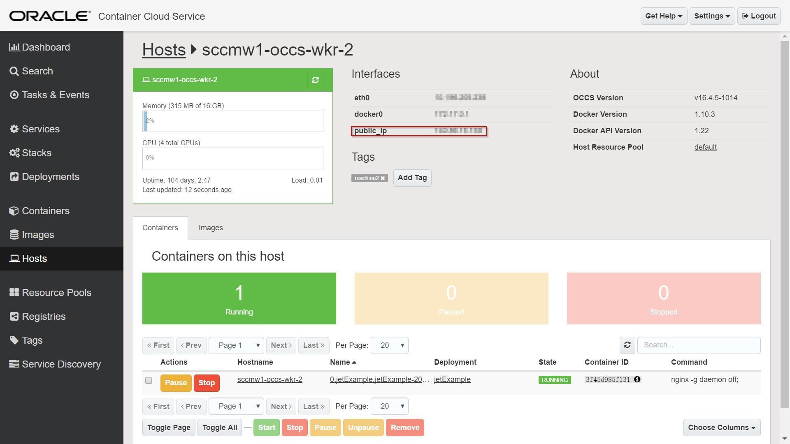

Scenario 2 - Verify the first Deployment
----------------------------------------

1.  새로운 브라우저 창을 엽니다.

2.  jetExample 내의 Running중인jet-docker 앱에 액세스 할 수 있는 URL 입력하세요

    -   \<public_ip\> 호스트 페이지의 **public_ip** 필드에서 복사한 값입니다.

    -   9999 는 이전에 컨테이너 포트 80에 매핑한 호스트 포트 입니다.

        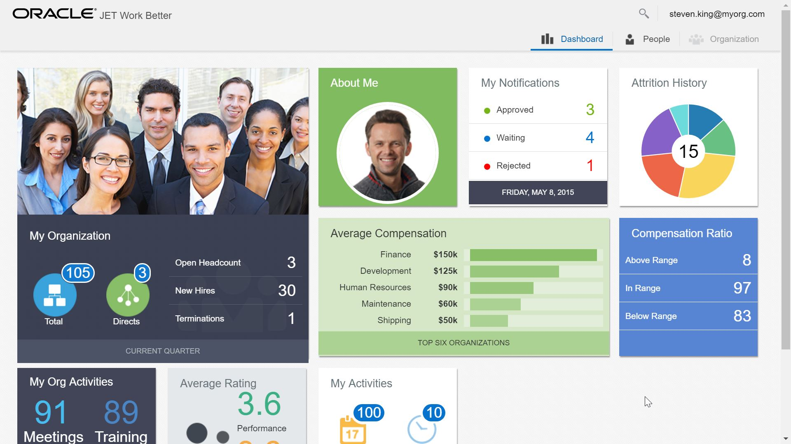

        이제 Docker Hub에서 jet-docker 애플리케이션을 성공적으로 구축하고 Oracle
        Container Cloud Service를 사용하여 실행중인 Docker 컨테이너에
        배포했습니다.

Scenario 2 - Modify the Application in GitHub
---------------------------------------------

이제 About Me에 대한 사진을 바꿀 것입니다.

1.  GitHub 돌아가서 방금 fork한 프로젝트를 열고 100.png 파일을 삭제합니다.

    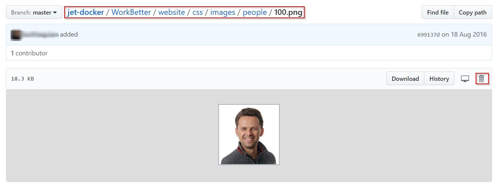

    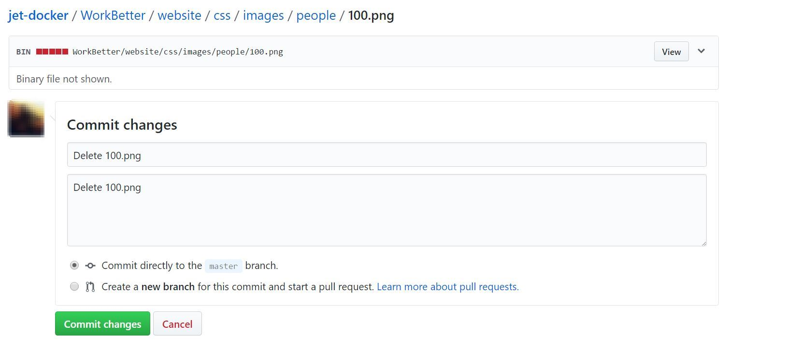

2.  새로운 100.png 파일 새로 업로드

    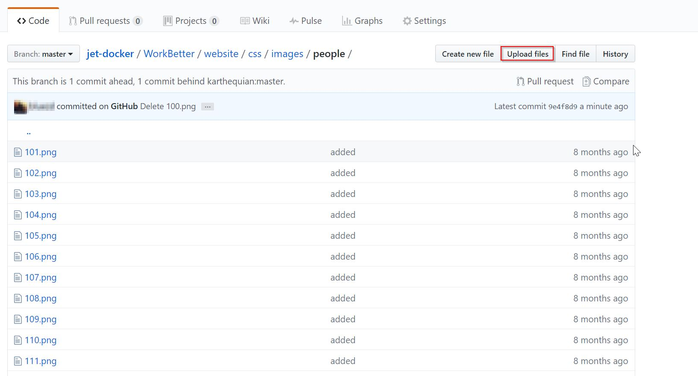

    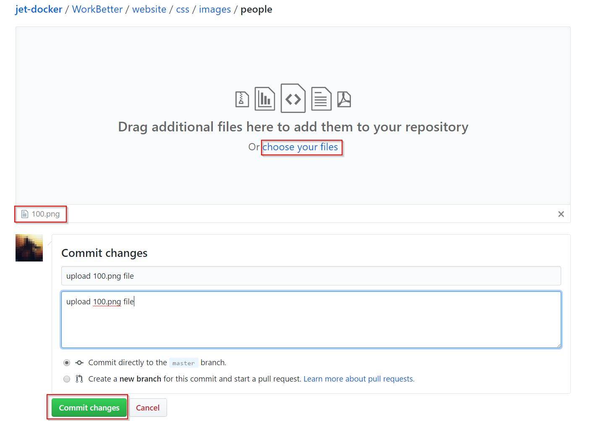

Scenario 2 - Verify the second Deployment
-----------------------------------------

1.  Docker Hub jet-docker 프로젝트 대시보드로 이동하여 Build Details선택

    

    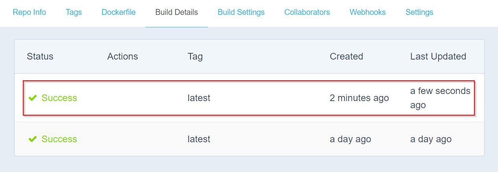

2.  Oracle Container Cloud Service로 돌아가서, 왼쪽 패널의**Deployments**를
    클릭하고 **Stop**을 클릭하여 컨테이너를 중지시킵니다.

    

3.  컨테이너가 중지되었습니다. 시작을 클릭하여 다시 시작하십시오.

    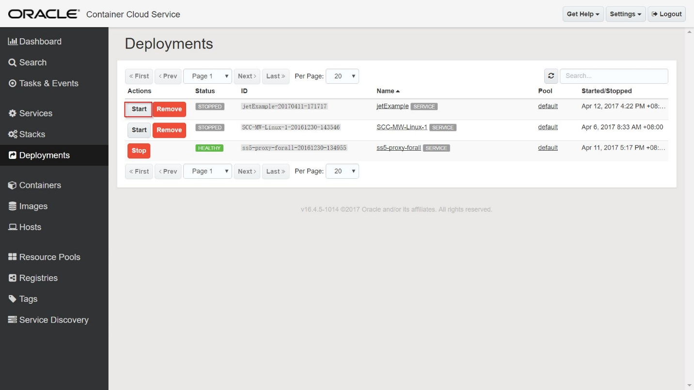

4.  서비스가 다시 시작 되었습니다.

    Docker Hub에서 최신 이미지 가져오기

5.  결과 확인, 새 브라우저 창 열기:

    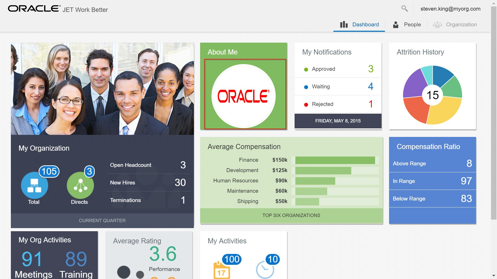

    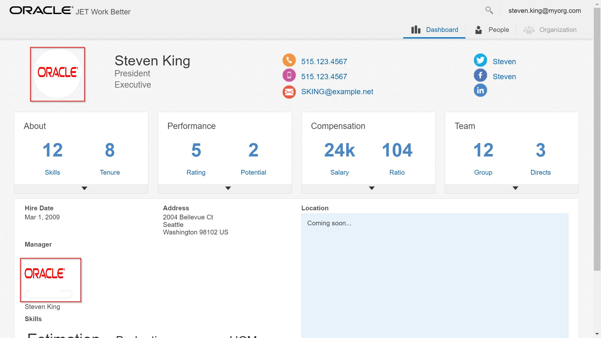

    수정 사항이 적용됩니다!