Lab 400
============================

Container Cloud Service Hands-on Guide
======================================

*Stack을 사용한 WebLogic Cluster 배포*
======================================

Introduction 
-------------

이 튜토리얼은 Container Cloud Service 내의 Stack을 사용하여 로드밸런서가 있는
WebLogic Cluster를 쉽게 만들고 클러스터 Scale out 및 로드밸런스 기능을 테스트
하는 것을 보여줍니다.

### Objectives

-   로컬 환경에 빌드

-   별도의 Docker 이미지 생성

-   만들어진 Docker image를 Docker HUB에 Push

-   Weblogic cluster stack 생성

-   Weblogic cluster stack 인스턴스 배포

-   Weblogic cluster 인스턴스 확장 및 로드밸런싱 테스트

### Required Artifacts 

OCCS를 사용하려면 먼저 다음을 수행하십시오.

귀하 또는 귀하 조직의 다른 누군가가 OCCS 가입을 주문하고 활성화해야합니다.

자세한 내용은 Oracle 도움말 센터에서 [Oracle Container Cloud
Service](http://docs.oracle.com/cloud/latest/container-cloud/CONTU/toc.htm)
사용을 참조하십시오.

OCCS 서비스 콘솔을 사용하기 전에 다음을 수행하십시오.

우리는 OCCS 인스턴스가 필요합니다, 이전 Lab 100에서 생성했던 환경을 그대로
사용합니다.

로드밸런서 기능을 가진 웹로직 클러스터를 배포하기 전에 다음을 수행하십시오

You need to have an account on
[hub.docker.com](file:///D:\My_Project\Korea%20OCCS%20Lab\hub.docker.com) 이러한
별도의 Docker 이미지들을 보유하고
있는[hub.docker.com](file:///D:\My_Project\Korea%20OCCS%20Lab\hub.docker.com) 에
계정이 필요합니다. OCCS에서 해당 이미지를 사용하여 Stack을 만듭니다.

계정 이름은 자유롭게 지정할 수 있습니다.

Stack을 만들기 전에 다음을 수행하십시오.

Docker 실행 환경이 포함된 Linux 호스트 또는 VM이 있어야 합니다. 이 Linux
호스트는 hub.docker.com 에서 연결하여 Docker 이미지를 가져오거나 푸시할 수
있습니다.

### OutLine

[Introduction 2](#introduction)

[Objectives 2](#objectives)

[Required Artifacts 2](#required-artifacts)

[OutLine 3](#outline)

[Build the local environment 4](#build-the-local-environment)

[Create separate Docker images 9](#create-separate-docker-images)

[Push Docker images to Docker HUB 15](#push-docker-images-to-docker-hub)

[Create a Weblogic cluster stack 17](#create-a-weblogic-cluster-stack)

[Deploy a Weblogic cluster stack instance
22](#deploy-a-weblogic-cluster-stack-instance)

[Scale out the Weblogic cluster instance and test load balance
28](#scale-out-the-weblogic-cluster-instance-and-test-load-balance)

Build the local environment
---------------------------

1.  Docker 실행 환경을 먼저 확인하고 SSH 도구를 사용하여 Docker Linux 호스트에
    연결하십시오 (예 : Putty). docker 서비스가 실행 중인지 확인하십시오.

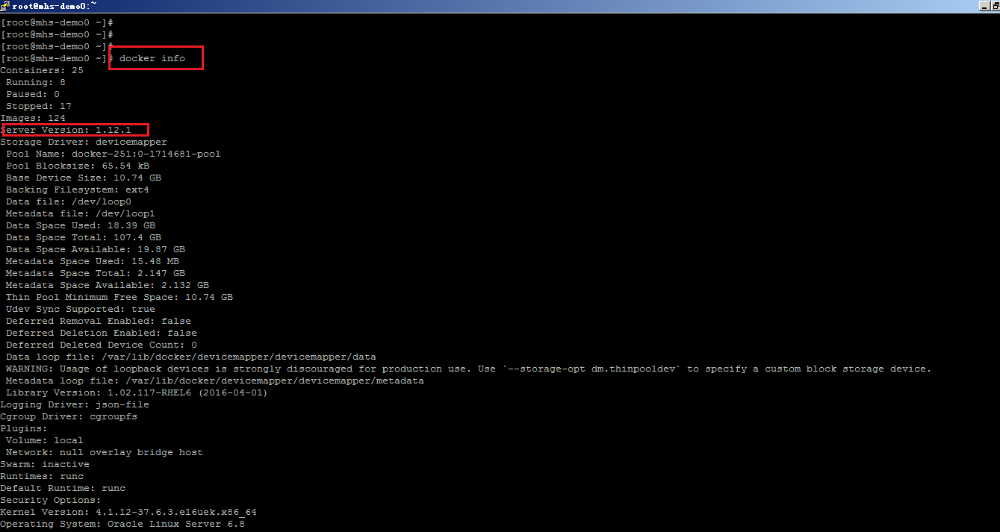

1.  브라우저 탭을 열고 URL을 입력하십시오:
    <https://github.com/oracle/docker-images>

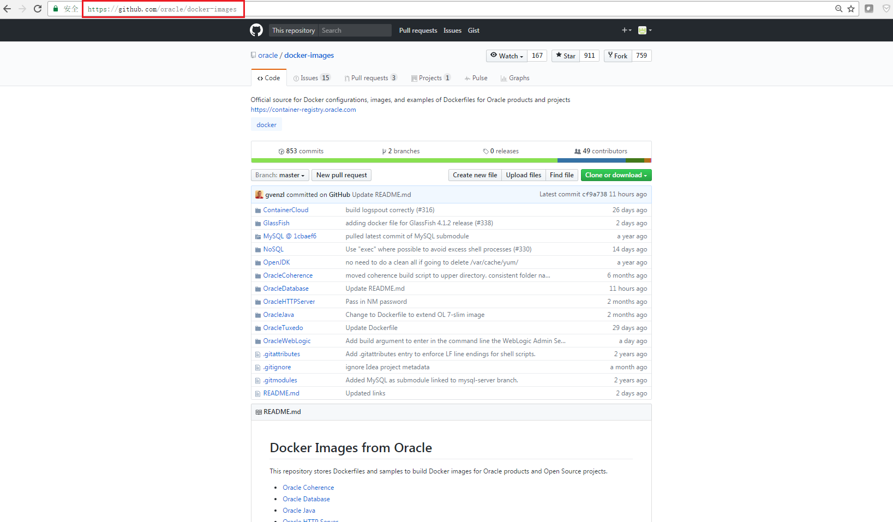

1.  “Clone or download” 클릭 후에 “Download ZIP”클릭 하면 파일 대화 창이 열리고,
    당신의 컴퓨터에 “docker-images-master.zip” 을 저장합니다.

>   [./media/image4.png](./media/image4.png)

1.  ”docker-images-master.zip” 파일을 Docker 호스트에 업로드한 후 적당한 경로에
    파일 압축을 푼 후 가이드에 따라 root 유저로 로그인해서 zip파일을 root의
    default 경로인 /root에 놓는다.

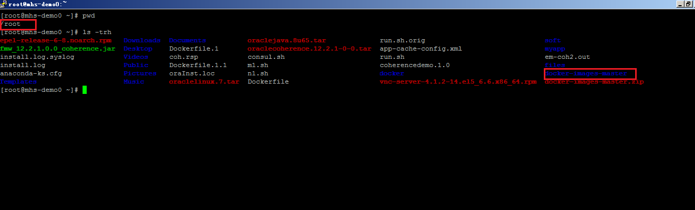

1.  브라우저 탭을 열고 URL을 입력하십시오:
    http://www.oracle.com/technetwork/java/javase/downloads/server-jre8-downloads-2133154.html
    JRE 8 설치 파일 다운로드를 위해서 “server-jre-8u1xx-linux-x64.tar.gz”
    클릭하여 다운로드 합니다.

>   [./media/image6.png](./media/image6.png)

1.  브라우저 탭을 열고 URL을 입력하십시오:
    <http://www.oracle.com/technetwork/middleware/weblogic/downloads/wls-for-dev-1703574.html>
    접속해서 “Quick Installer for Mac OSX, Windows and Linux “을 다운로드 하기
    위해 클릭 하십시오 (ZIP Filename: fmw_12.2.1.2.0_wls_quick_Disk1_1of1.zip)

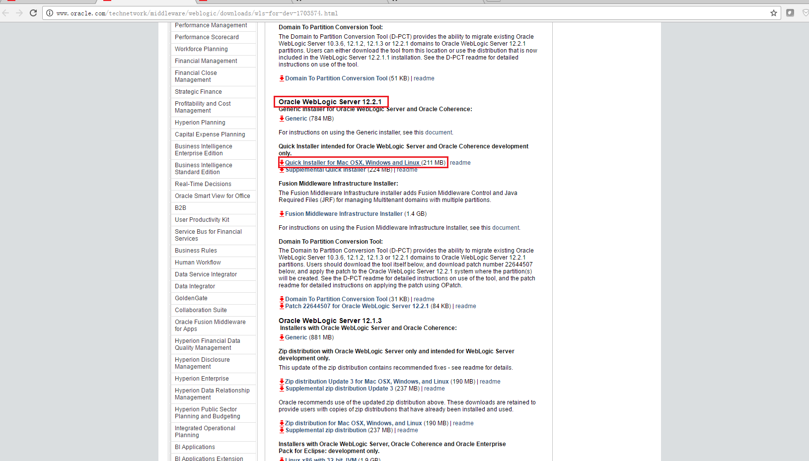

1.  “server-jre-8u121-linux-x64.tar.gz”을 Docker 호스트에 업로드 하십시오,
    경로는
    “/root/docker-images-master/OracleJava/java-8/server-jre-8u121-linux-x64.tar.gz”,
    이후  
    “server-jre-8u101-linux-x64.tar.gz.download”.파일을 지우십시오

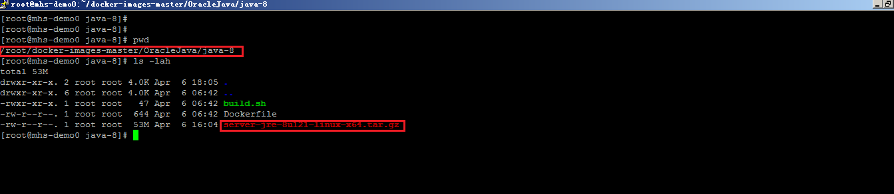

1.  Docker 호스트에 “fmw_12.2.1.0.0_wls_quick_Disk1_1of1.zip” 을 업로드
    하십시오, 경로는
    “/root/docker-images-master/OracleWebLogic/dockerfiles/12.2.1/fmw_12.2.1.0.0_wls_quick_Disk1_1of1.zip”,
    이후 “fmw_12.2.1.0.0_wls_quick_Disk1_1of1.zip.download” 파일은 지우십시오.

Create separate Docker images
-----------------------------

1.  Java Docker 이미지를 빌드하고다음 명령을 실행합니다

>   \# cd /root/docker-images-master/OracleJava/java-8

>   \# docker build -t oracle/serverjre:8 .

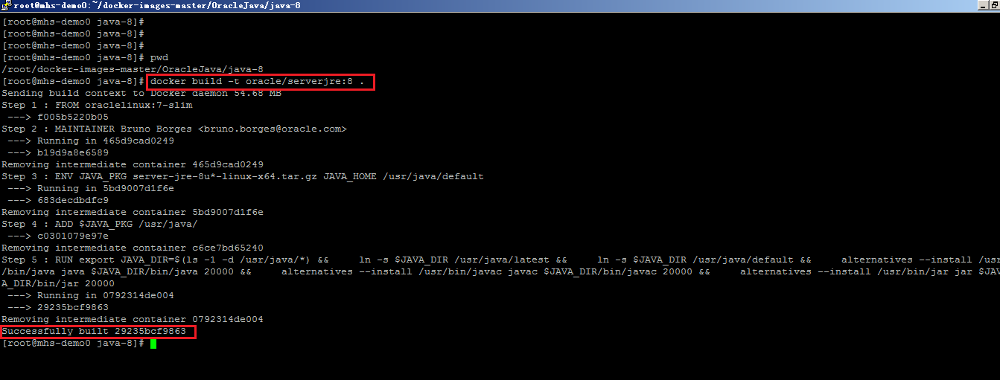

1.  WebLogic Docker 이미지는 이전 JRE를 기반으로 하며 다음 명령어를 실행합니다.

>   \#cd /root/docker-images-master/OracleWebLogic/dockerfiles

>   \# ./buildDockerImage.sh -v 12.2.1 -d

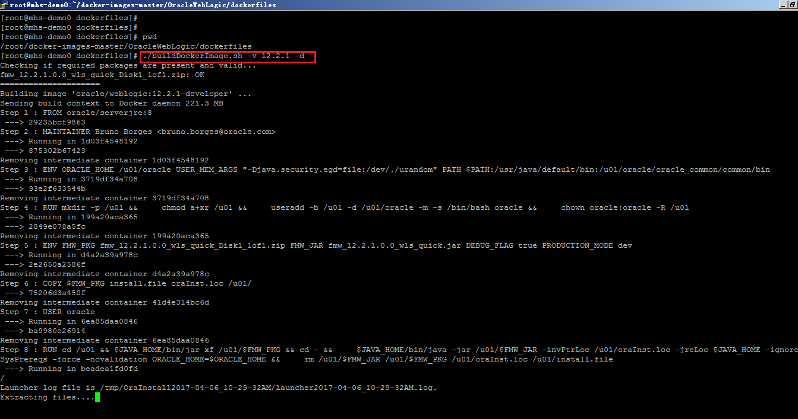

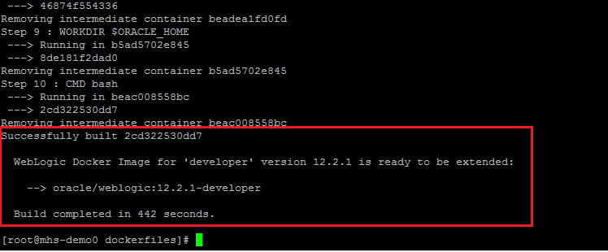

1.  이전의 Weblogic Docker 이미지를 도메인이있는 새 이미지로 확장하고 다음
    명령을 실행합니다

>   \#cd /root/docker-images-master/OracleWebLogic/samples/1221-domain

>   \# docker build --force-rm -t 1221-domain --build-arg
>   ADMIN_PASSWORD=welcome1 --build-arg ADMIN_PORT=8001 .

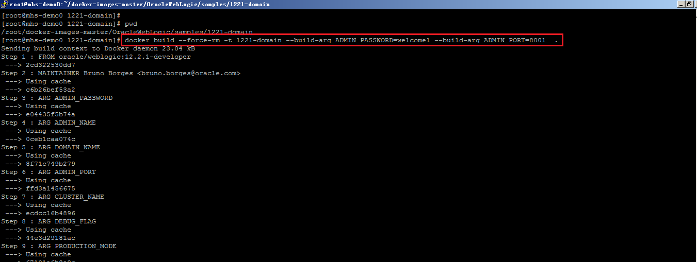

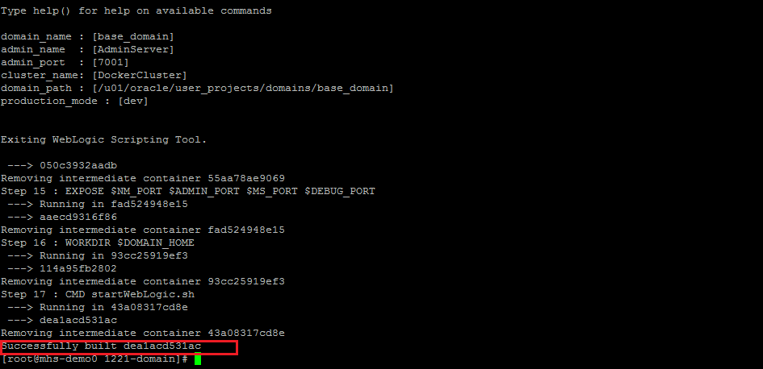

1.  새로운 도메인 이미지를 다시 확장하고 최신 이미지에 간단한 데모 Application이
    포함 되도록 다음 명령어를 실행합니다.

>   \# cd /root/docker-images-master/OracleWebLogic/samples/1221-appdeploy

>   \# docker build --force-rm -t 1221-appdeploy .

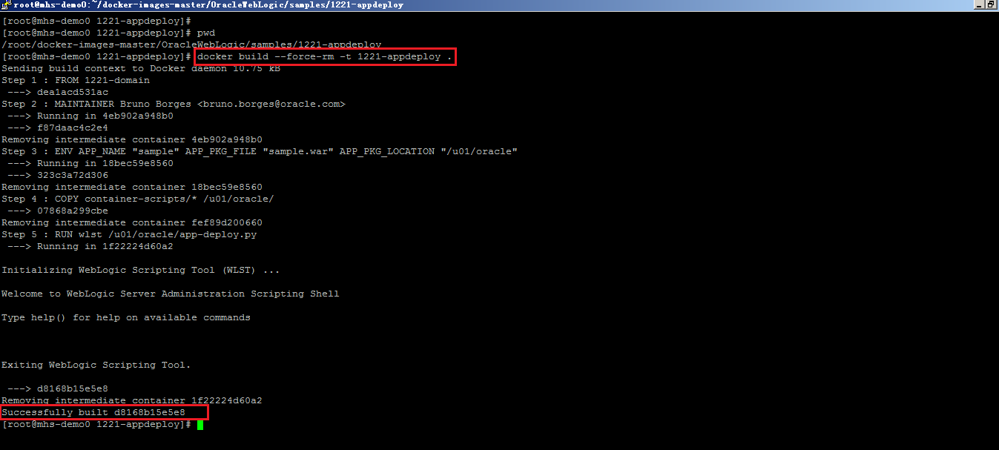

1.  로드밸런서 Docker 이미지는 runit 과 confd 를 기반으로 하며 Container Cloud에
    내장된 service discovery 메커니즘과 통신할 것입니다. 이는 managed server들이
    WebLogic Cluster에 추가될 때 Dynamic 로드 밸런싱을 제공합니다. 이 사용자
    정의 로드밸런서 이미지를 빌드하려면 nginx-lb 이미지를 빌드해야 합니다.  
    다음 명령을 실행 하십시오.

>   \# cd /root/docker-images-master/ContainerCloud/images/runit

>   \# make image

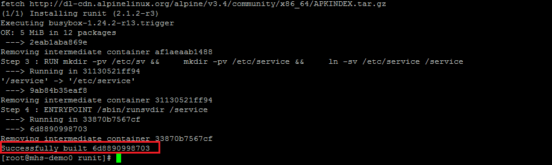

>   \# cd ../confd

>   \#make image

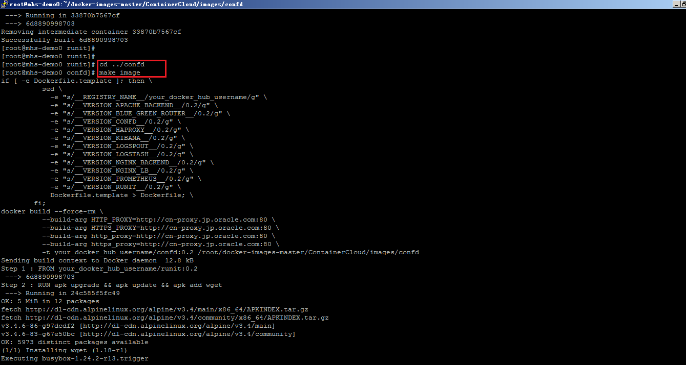

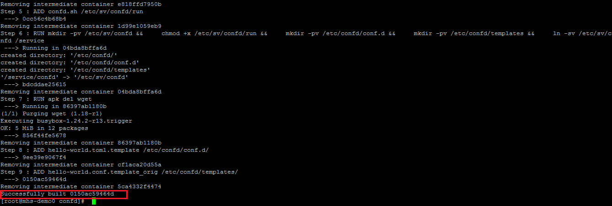

>   \# cd ../nginx-lb

>   \# make image

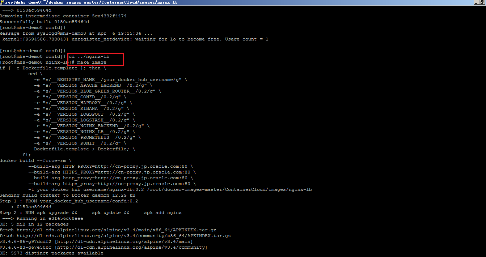

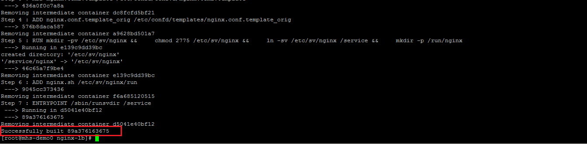

1.  이 시점에서, Java 와 WebLogic 이미지를 로드 밸런서 이미지와 함께 빌드하면
    다음과 같이 표시되어야 합니다.

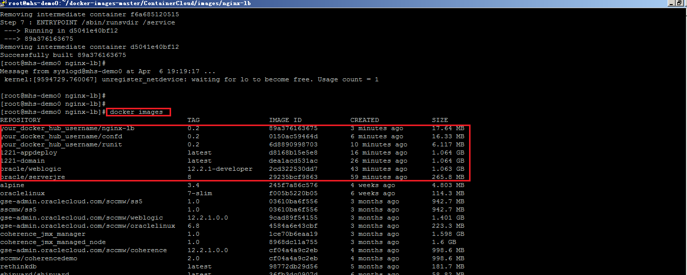

Push Docker images to Docker HUB 
---------------------------------

이제 모든 이미지가 빌드되었으므로 이미지를 Docker 허브 (hub.docker.com)로
푸시해야합니다.

1.  First login into your Docker HUB account 먼저 command 라인에서 Docker hub
    계정에 로그인 합니다.

>   \#docker login

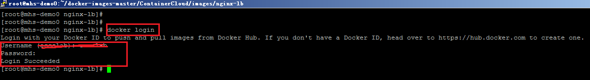

1.  Weblogic 이미지 용 새 태그를 지정합니다.

>   \#docker tag 1221-appdeploy:latest
>   \<docker_hub_account_id\>/1221-appdeploy:0.2

>   \#docker push \<docker_hub_account_id\>/1221-appdeploy:0.2

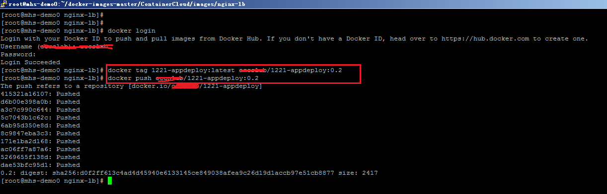

1.  위에 설명한 과정을 반복하여 nginx-lb 이미지를 Docker hub에 푸시합니다.

>   \# docker tag your_docker_hub_username/nginx-lb:0.2
>   \<docker_hub_account_id\>/nginx-lb:0.2

>   \# docker push \<docker_hub_account_id\>/nginx-lb:0.2

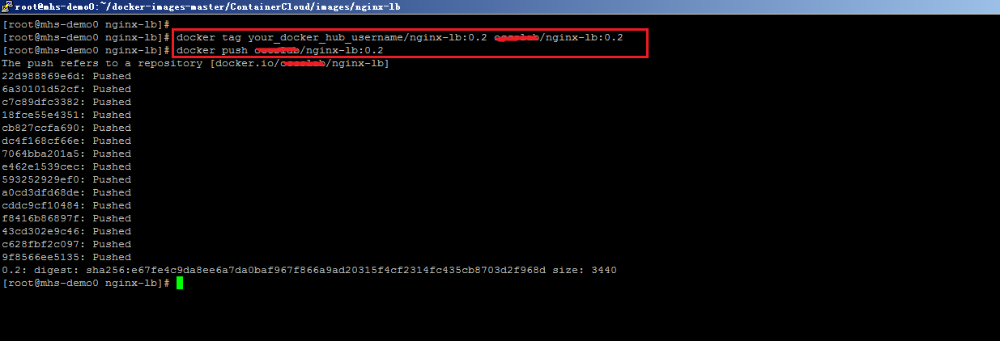

1.  새 브라우저 탭을 열고 URL(<http://hub.docker.com> ) 입력하고 Docker hub 계정
    ID를 사용하여 로그인 하십시오. Docker image가 여기에 있는지 확인하십시오.

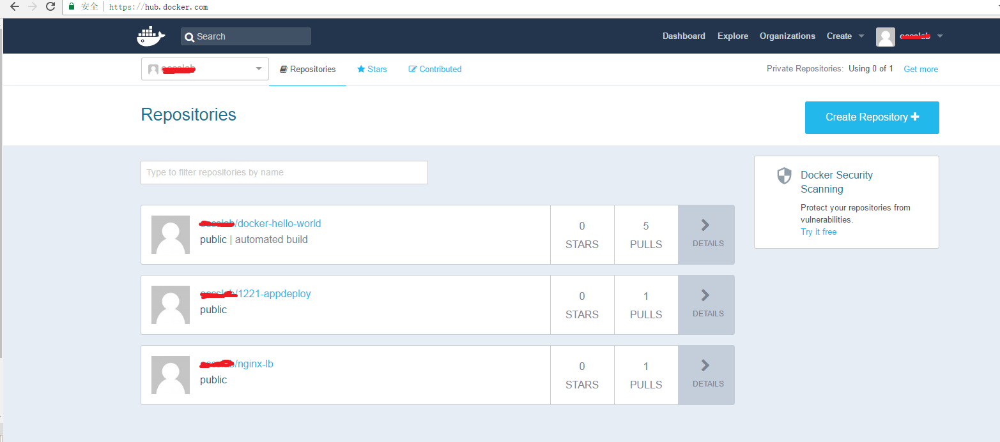

Create a Weblogic cluster stack 
--------------------------------

1.  OCCS 콘솔을 열고 계정에 로그인 하십시오, 배포된 컨테이너 용 애플리케이션
    그룹 , 컨테이너가 실행중인 물리적 서버의 호스트 및 기타 등등에 대한
    Metric들을 볼 수 있어 당신의 서비스가 어떻게 작동하고 있는지를 확인 할 수
    있는 메인 대시보드에 들어갈 수 있다

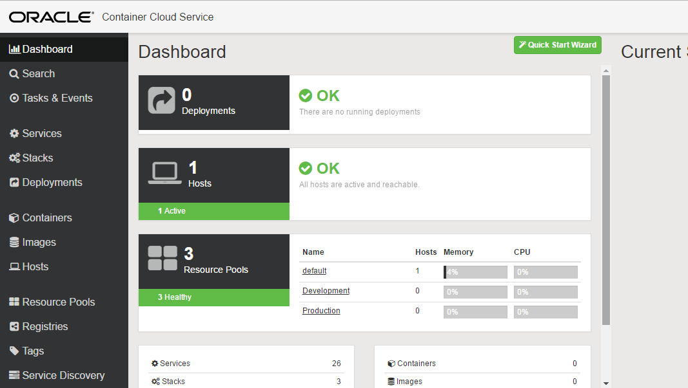

1.  좌측 메뉴의 “Stacks”을 클릭, 모든 stack 목록이 오른쪽 패널에 있습니다.

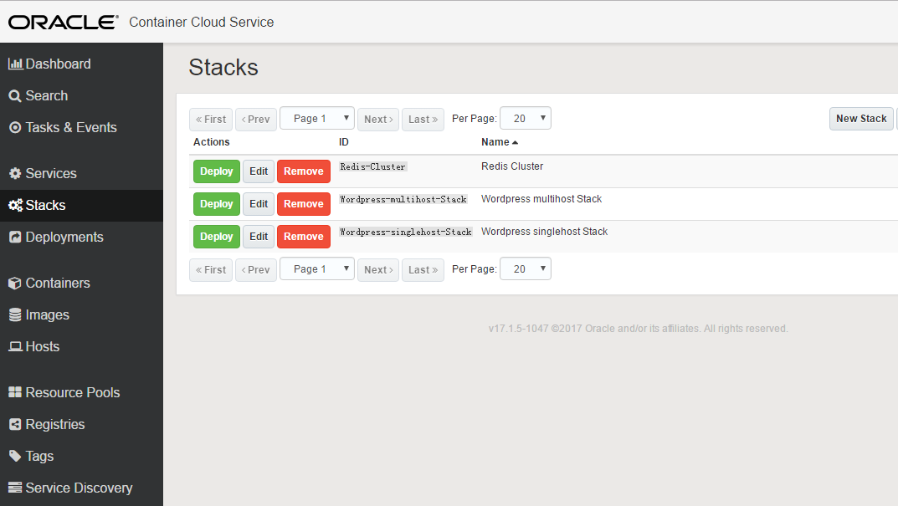

1.  오른쪽 상단의 “New Stack” 클릭 , “WLS-multi-host-LB”라는 새로운 Stack이
    생성됩니다.

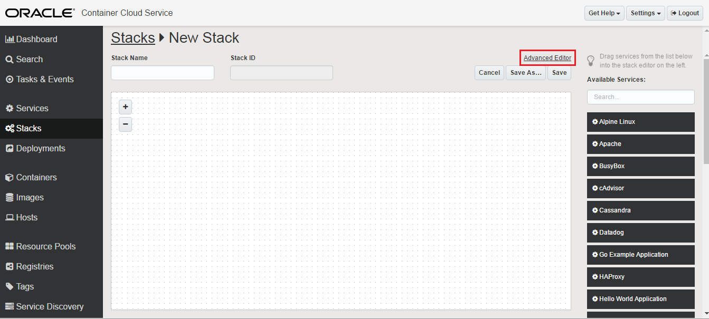

1.  “Docker Compose” 포맷과 유사한 Stack editor인 “Advanced Editor”를 클릭
    합니다.

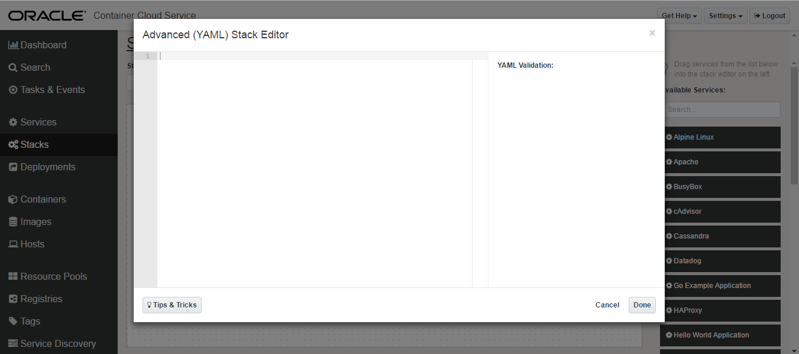

1.  Copy and paste 다음 라인들을 Editor에 복사하고 붙여 넣으세요.

version: "2"

services:

weblogic-admin:

image: "\<docker_hub_account_id\>/1221-appdeploy:0.2"

ports:

\- "8001:8001/tcp"

environment:

\- OCCS_PHASE_ID=0

\- "OCCS:availability=per-pool"

\- "OCCS:description=This is an example of a clustered weblogic server."

\- "OCCS_HEALTHCHECK_HTTP=http://:8001/console/?timeout=10s&interval=30s"

weblogic-managed-server:

image: "\<docker_hub_account_id\>/1221-appdeploy:0.2"

ports:

\- 7002/tcp

\- 5556/tcp

environment:

\- OCCS_PHASE_ID=1

\- "OCCS_BACKEND_KEY={{ sd_deployment_containers_path \\"weblogic-admin\\" 8001
}}"

\- "OCCS_SELF_KEY={{ sd_deployment_containers_path \\"weblogic-managed-server\\"
5556 }}"

\- "OCCS:description=This is the weblogic managed server."

\- "occs:availability=per-pool"

\- "OCCS_HEALTHCHECK_HTTP=http://:7002/sample/?timeout=10s&interval=30s"

command: "bash -c \\"i=0;seconds=30; trap 'echo Exiting application; exit'
SIGHUP SIGINT SIGTERM; while [ \$i -lt \$seconds ]; do echo Waiting
\$i/\$seconds!; ((i=i+1)); sleep 1; done; export ADMIN_HOST=\$(curl -s
172.17.0.1:9109/api/kv/\${OCCS_BACKEND_KEY}?keys=true \| sed -r -e
's/(\\\\\\"\|\\\\\\\\[\|\\\\\\\\])//g' \| xargs -iKEY bash -c 'curl -s
172.17.0.1:9109/api/kv/KEY?raw=true' \| sed -r -e 's/\^(.+):.+\$/\\\\\\\\1/');
echo ADMIN_HOST=\${ADMIN_HOST}; export CONTAINER_ID=\$(cat /proc/self/cgroup \|
grep 'cpu:/' \| sed -r 's/[0-9]+:cpu:.docker.//g'); export SELF=\$(curl -s
172.17.0.1:9109/api/kv/\${OCCS_SELF_KEY}/\${CONTAINER_ID}?raw=true); export
NM_HOST=\$(echo \${SELF} \| sed -r -e 's/\^(.+):.+\$/\\\\\\\\1/'); export
NM_PORT=\$(echo \${SELF} \| sed -r -e 's/\^.+:(.+)\$/\\\\\\\\1/'); export
MS_HOST=\${OCCS_HOSTIP}; echo CONTAINER_ID=\${CONTAINER_ID}; echo SELF=\${SELF};
echo NM_HOST=\${NM_HOST}; echo NM_PORT=\${NM_PORT}; createServer.sh\\""

loadbalancer:

image: "\<docker_hub_account_id\>/nginx-lb:0.2"

ports:

\- "8080:80/tcp"

environment:

\- OCCS_PHASE_ID=2

\- KV_IP=172.17.0.1

\- KV_PORT=9109

\- "OCCS_API_TOKEN={{api_token}}"

\- "OCCS_BACKEND_KEY={{ sd_deployment_containers_path
\\"weblogic-managed-server\\" 7002 }}"

\- "OCCS:description=This is the load balancer to front the weblogic managed
servers."

\- "occs:availability=per-pool"

\- "OCCS_HEALTHCHECK_HTTP=http://:8080/sample/?timeout=10s&interval=30s"

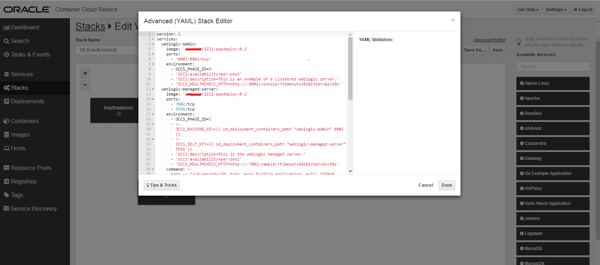

1.  “Done” 을 클릭해서 편집기를 닫으세요

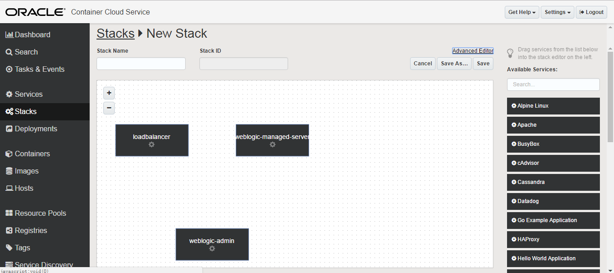

1.  Stack name : WLS-multi-host-LB 입력, 그리고 “Save” 클릭

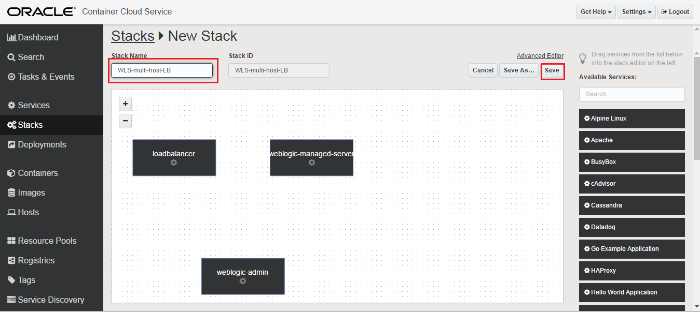

1.  새로운 Stack이 성공적으로 빌딩 되었다.

Deploy a Weblogic cluster stack instance
----------------------------------------

1.  WLS-multi-host-LB 대해서 “Deploy”를 클릭하세요

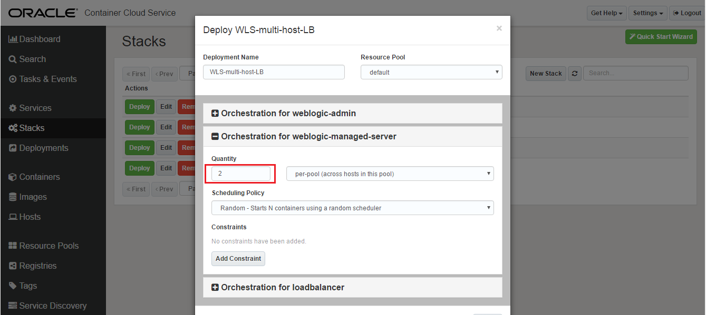

1.  필요로 하는 managed servers를 입력하세요, 예에서는 2를 선택하고 “Deploy”
    클릭

1.  동작하기 위한 새로운 배포가 이미 시작되고 Health-check를 통해서 새로 배포된
    것을 모니터링 하기 시작하는 것을 볼 수 있습니다.

    >   [./media/image37.png](./media/image37.png)

    >   Diapositiva09

2.  몇 분후에, Admin server 이미 실행 중입니다.

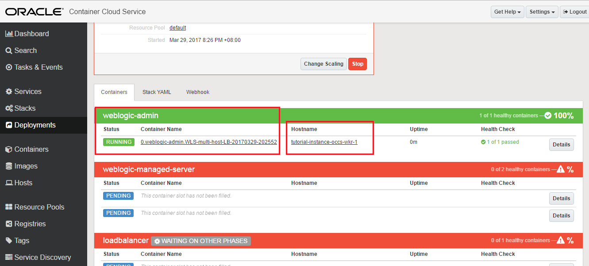

1.  Public IP 주소를 얻기 위해 Host인 “tutorial-instance-occs-wkr-1” 를
    클릭합니다.

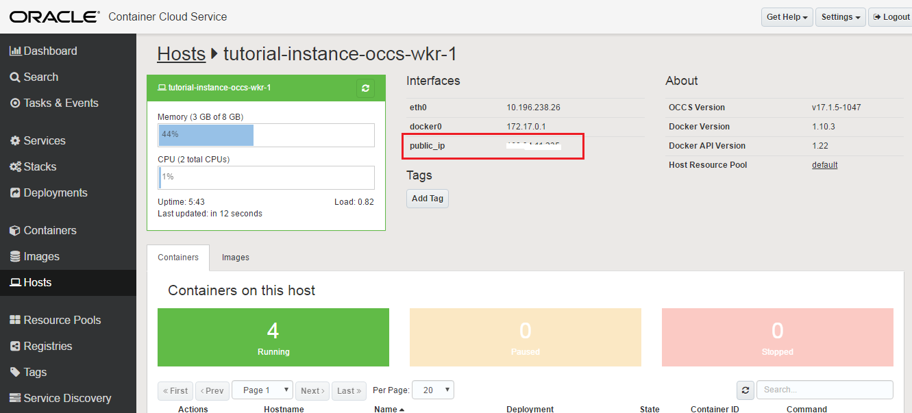

1.  Open a new browser tab with the public IP + predetermined port 8001 이 admin
    콘솔에 대해 Public IP + 미리 지정된 Port 8001로 새 브라우저 탭을 엽니다.
    예를들어 :

>   WebLogic admin 계정과 패스워드로 로그인 하십시오. (weblogic/welcome1).
>   Admin과

>   Admin 서버 세부 정보를 확인 할 수 있습니다.

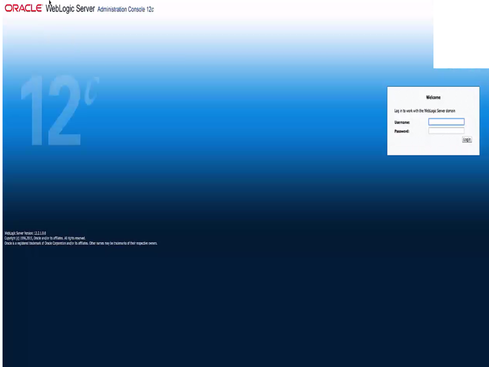

1.  deployment로 돌아가면 2개의 managed server와 nginx 로드밸런서가
    health-checks를 통과하여 running 중임을 확인할 수 있습니다.

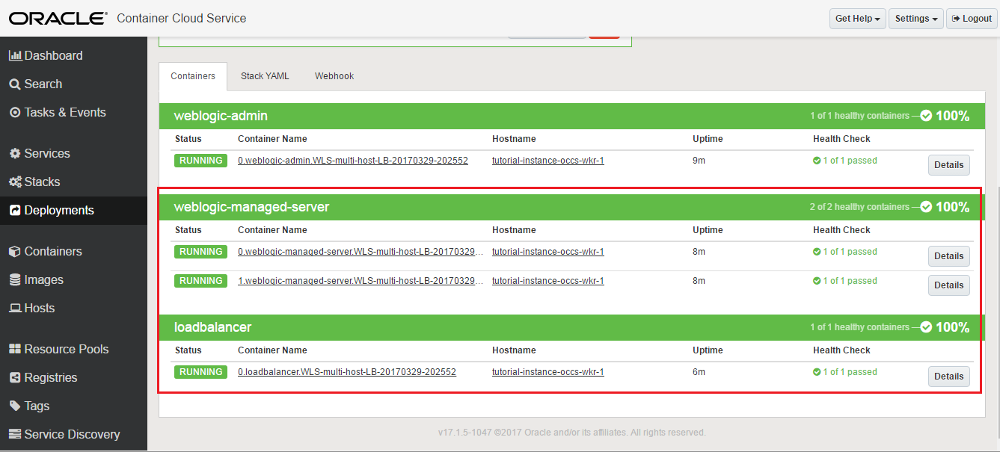

1.  새로운 브라우저 탭을 열고 managed server 응답을 확인 하십시오.

>   url 입력:

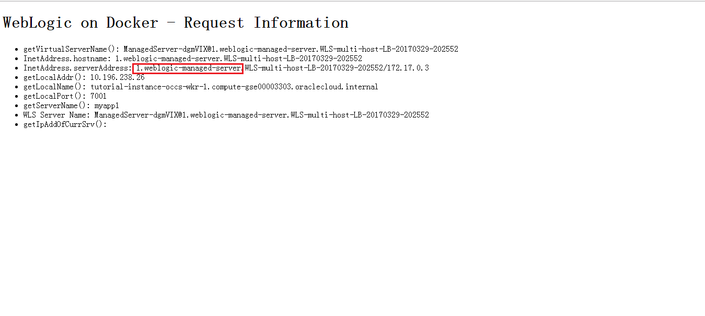

1.  페이지 응답은 managed server 1 에서 발생하며 , F5를 누르면 페이지가 새로
    고쳐 지면서 이번에는 managed server 0 응답을 보냅니다.

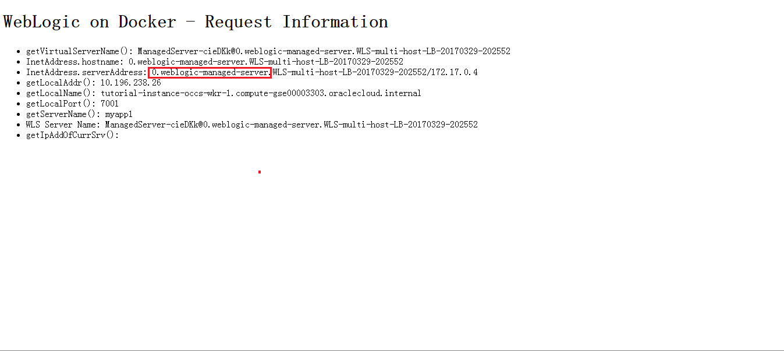

Scale out the Weblogic cluster instance and test load balance 
--------------------------------------------------------------

1.  이 파트는 3초 이내에 weblogic cluster를 확장하는 것입니다. “Change
    Scaling”의 버튼을 클릭합니다.

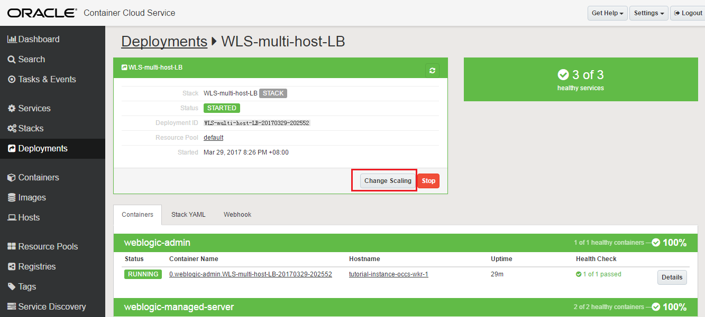

1.  우리가 원하는 대로 managed servers 수를 변경할 수 있습니다, 이 예제에서는
    1개의 서버를 추가할 것입니다.

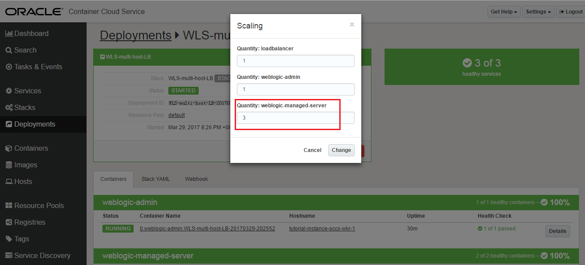

1.  스케일 아웃 수행을 위해 “Change”를 클릭합니다.

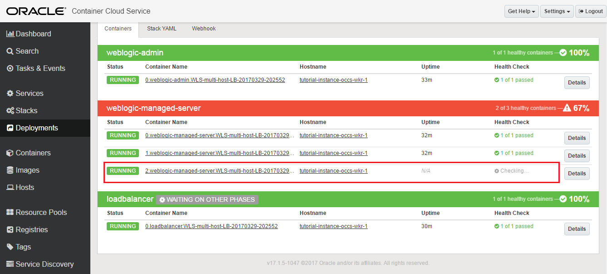

1.  몇 초후에 , 세번째 managed server 인스턴스가 준비되어야 합니다, 마지막으로
    모든 서버가 실행됩니다.

>   브라우저 테스트 페이지로 돌아가서, F5를 몇 번 누르면 새로운 managed server
>   instance – 2가 요청을 처리합니다. 물론 모든 로드는 Round-robin 로드 밸런서에
>   의해서 처리됩니다.

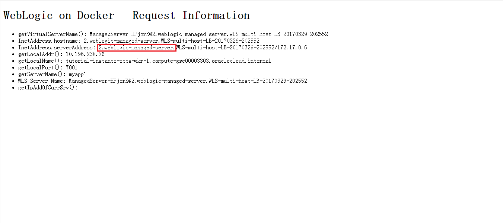
=======
[./media/image1.png](./media/image1.png)
========================================

Lab 400

Oracle Public Cloud Workshop
============================

Container Cloud Service Hands-on Guide
======================================

*Stack을 사용한 WebLogic Cluster 배포*
======================================

-   Zhu Dong (<dong.zhu@oracle.com>), Ke Wang (<ke.w.wang@oracle.com>)

May 19, 2017

Introduction 
-------------

이 튜토리얼은 Container Cloud Service 내의 Stack을 사용하여 로드밸런서가 있는
WebLogic Cluster를 쉽게 만들고 클러스터 Scale out 및 로드밸런스 기능을 테스트
하는 것을 보여줍니다.

### Objectives

-   로컬 환경에 빌드

-   별도의 Docker 이미지 생성

-   만들어진 Docker image를 Docker HUB에 Push

-   Weblogic cluster stack 생성

-   Weblogic cluster stack 인스턴스 배포

-   Weblogic cluster 인스턴스 확장 및 로드밸런싱 테스트

### Required Artifacts 

OCCS를 사용하려면 먼저 다음을 수행하십시오.

귀하 또는 귀하 조직의 다른 누군가가 OCCS 가입을 주문하고 활성화해야합니다.

자세한 내용은 Oracle 도움말 센터에서 [Oracle Container Cloud
Service](http://docs.oracle.com/cloud/latest/container-cloud/CONTU/toc.htm)
사용을 참조하십시오.

OCCS 서비스 콘솔을 사용하기 전에 다음을 수행하십시오.

우리는 OCCS 인스턴스가 필요합니다, 이전 Lab 100에서 생성했던 환경을 그대로
사용합니다.

로드밸런서 기능을 가진 웹로직 클러스터를 배포하기 전에 다음을 수행하십시오

You need to have an account on
[hub.docker.com](file:///D:\My_Project\Korea%20OCCS%20Lab\hub.docker.com) 이러한
별도의 Docker 이미지들을 보유하고
있는[hub.docker.com](file:///D:\My_Project\Korea%20OCCS%20Lab\hub.docker.com) 에
계정이 필요합니다. OCCS에서 해당 이미지를 사용하여 Stack을 만듭니다.

계정 이름은 자유롭게 지정할 수 있습니다.

Stack을 만들기 전에 다음을 수행하십시오.

Docker 실행 환경이 포함된 Linux 호스트 또는 VM이 있어야 합니다. 이 Linux
호스트는 hub.docker.com 에서 연결하여 Docker 이미지를 가져오거나 푸시할 수
있습니다.

### OutLine

[Introduction 2](#introduction)

[Objectives 2](#objectives)

[Required Artifacts 2](#required-artifacts)

[OutLine 3](#outline)

[Build the local environment 4](#build-the-local-environment)

[Create separate Docker images 9](#create-separate-docker-images)

[Push Docker images to Docker HUB 15](#push-docker-images-to-docker-hub)

[Create a Weblogic cluster stack 17](#create-a-weblogic-cluster-stack)

[Deploy a Weblogic cluster stack instance
22](#deploy-a-weblogic-cluster-stack-instance)

[Scale out the Weblogic cluster instance and test load balance
28](#scale-out-the-weblogic-cluster-instance-and-test-load-balance)

Build the local environment
---------------------------

1.  Docker 실행 환경을 먼저 확인하고 SSH 도구를 사용하여 Docker Linux 호스트에
    연결하십시오 (예 : Putty). docker 서비스가 실행 중인지 확인하십시오.

1.  브라우저 탭을 열고 URL을 입력하십시오:
    <https://github.com/oracle/docker-images>

1.  “Clone or download” 클릭 후에 “Download ZIP”클릭 하면 파일 대화 창이 열리고,
    당신의 컴퓨터에 “docker-images-master.zip” 을 저장합니다.

>   [./media/image4.png](./media/image4.png)

1.  ”docker-images-master.zip” 파일을 Docker 호스트에 업로드한 후 적당한 경로에
    파일 압축을 푼 후 가이드에 따라 root 유저로 로그인해서 zip파일을 root의
    default 경로인 /root에 놓는다.

1.  브라우저 탭을 열고 URL을 입력하십시오:
    http://www.oracle.com/technetwork/java/javase/downloads/server-jre8-downloads-2133154.html
    JRE 8 설치 파일 다운로드를 위해서 “server-jre-8u1xx-linux-x64.tar.gz”
    클릭하여 다운로드 합니다.

>   [./media/image6.png](./media/image6.png)

1.  브라우저 탭을 열고 URL을 입력하십시오:
    <http://www.oracle.com/technetwork/middleware/weblogic/downloads/wls-for-dev-1703574.html>
    접속해서 “Quick Installer for Mac OSX, Windows and Linux “을 다운로드 하기
    위해 클릭 하십시오 (ZIP Filename: fmw_12.2.1.2.0_wls_quick_Disk1_1of1.zip)

1.  “server-jre-8u121-linux-x64.tar.gz”을 Docker 호스트에 업로드 하십시오,
    경로는
    “/root/docker-images-master/OracleJava/java-8/server-jre-8u121-linux-x64.tar.gz”,
    이후  
    “server-jre-8u101-linux-x64.tar.gz.download”.파일을 지우십시오

1.  Docker 호스트에 “fmw_12.2.1.0.0_wls_quick_Disk1_1of1.zip” 을 업로드
    하십시오, 경로는
    “/root/docker-images-master/OracleWebLogic/dockerfiles/12.2.1/fmw_12.2.1.0.0_wls_quick_Disk1_1of1.zip”,
    이후 “fmw_12.2.1.0.0_wls_quick_Disk1_1of1.zip.download” 파일은 지우십시오.

Create separate Docker images
-----------------------------

1.  Java Docker 이미지를 빌드하고다음 명령을 실행합니다

>   \# cd /root/docker-images-master/OracleJava/java-8

>   \# docker build -t oracle/serverjre:8 .

1.  WebLogic Docker 이미지는 이전 JRE를 기반으로 하며 다음 명령어를 실행합니다.

>   \#cd /root/docker-images-master/OracleWebLogic/dockerfiles

>   \# ./buildDockerImage.sh -v 12.2.1 -d

1.  이전의 Weblogic Docker 이미지를 도메인이있는 새 이미지로 확장하고 다음
    명령을 실행합니다

>   \#cd /root/docker-images-master/OracleWebLogic/samples/1221-domain

>   \# docker build --force-rm -t 1221-domain --build-arg
>   ADMIN_PASSWORD=welcome1 --build-arg ADMIN_PORT=8001 .

1.  새로운 도메인 이미지를 다시 확장하고 최신 이미지에 간단한 데모 Application이
    포함 되도록 다음 명령어를 실행합니다.

>   \# cd /root/docker-images-master/OracleWebLogic/samples/1221-appdeploy

>   \# docker build --force-rm -t 1221-appdeploy .

1.  로드밸런서 Docker 이미지는 runit 과 confd 를 기반으로 하며 Container Cloud에
    내장된 service discovery 메커니즘과 통신할 것입니다. 이는 managed server들이
    WebLogic Cluster에 추가될 때 Dynamic 로드 밸런싱을 제공합니다. 이 사용자
    정의 로드밸런서 이미지를 빌드하려면 nginx-lb 이미지를 빌드해야 합니다.  
    다음 명령을 실행 하십시오.

>   \# cd /root/docker-images-master/ContainerCloud/images/runit

>   \# make image

>   \# cd ../confd

>   \#make image

>   \# cd ../nginx-lb

>   \# make image

1.  이 시점에서, Java 와 WebLogic 이미지를 로드 밸런서 이미지와 함께 빌드하면
    다음과 같이 표시되어야 합니다.

Push Docker images to Docker HUB 
---------------------------------

이제 모든 이미지가 빌드되었으므로 이미지를 Docker 허브 (hub.docker.com)로
푸시해야합니다.

1.  First login into your Docker HUB account 먼저 command 라인에서 Docker hub
    계정에 로그인 합니다.

>   \#docker login

1.  Weblogic 이미지 용 새 태그를 지정합니다.

>   \#docker tag 1221-appdeploy:latest
>   \<docker_hub_account_id\>/1221-appdeploy:0.2

>   \#docker push \<docker_hub_account_id\>/1221-appdeploy:0.2

1.  위에 설명한 과정을 반복하여 nginx-lb 이미지를 Docker hub에 푸시합니다.

>   \# docker tag your_docker_hub_username/nginx-lb:0.2
>   \<docker_hub_account_id\>/nginx-lb:0.2

>   \# docker push \<docker_hub_account_id\>/nginx-lb:0.2

1.  새 브라우저 탭을 열고 URL(<http://hub.docker.com> ) 입력하고 Docker hub 계정
    ID를 사용하여 로그인 하십시오. Docker image가 여기에 있는지 확인하십시오.

Create a Weblogic cluster stack 
--------------------------------

1.  OCCS 콘솔을 열고 계정에 로그인 하십시오, 배포된 컨테이너 용 애플리케이션
    그룹 , 컨테이너가 실행중인 물리적 서버의 호스트 및 기타 등등에 대한
    Metric들을 볼 수 있어 당신의 서비스가 어떻게 작동하고 있는지를 확인 할 수
    있는 메인 대시보드에 들어갈 수 있다

1.  좌측 메뉴의 “Stacks”을 클릭, 모든 stack 목록이 오른쪽 패널에 있습니다.

1.  오른쪽 상단의 “New Stack” 클릭 , “WLS-multi-host-LB”라는 새로운 Stack이
    생성됩니다.

1.  “Docker Compose” 포맷과 유사한 Stack editor인 “Advanced Editor”를 클릭
    합니다.

1.  Copy and paste 다음 라인들을 Editor에 복사하고 붙여 넣으세요.

version: "2"

services:

weblogic-admin:

image: "\<docker_hub_account_id\>/1221-appdeploy:0.2"

ports:

\- "8001:8001/tcp"

environment:

\- OCCS_PHASE_ID=0

\- "OCCS:availability=per-pool"

\- "OCCS:description=This is an example of a clustered weblogic server."

\- "OCCS_HEALTHCHECK_HTTP=http://:8001/console/?timeout=10s&interval=30s"

weblogic-managed-server:

image: "\<docker_hub_account_id\>/1221-appdeploy:0.2"

ports:

\- 7002/tcp

\- 5556/tcp

environment:

\- OCCS_PHASE_ID=1

\- "OCCS_BACKEND_KEY={{ sd_deployment_containers_path \\"weblogic-admin\\" 8001
}}"

\- "OCCS_SELF_KEY={{ sd_deployment_containers_path \\"weblogic-managed-server\\"
5556 }}"

\- "OCCS:description=This is the weblogic managed server."

\- "occs:availability=per-pool"

\- "OCCS_HEALTHCHECK_HTTP=http://:7002/sample/?timeout=10s&interval=30s"

command: "bash -c \\"i=0;seconds=30; trap 'echo Exiting application; exit'
SIGHUP SIGINT SIGTERM; while [ \$i -lt \$seconds ]; do echo Waiting
\$i/\$seconds!; ((i=i+1)); sleep 1; done; export ADMIN_HOST=\$(curl -s
172.17.0.1:9109/api/kv/\${OCCS_BACKEND_KEY}?keys=true \| sed -r -e
's/(\\\\\\"\|\\\\\\\\[\|\\\\\\\\])//g' \| xargs -iKEY bash -c 'curl -s
172.17.0.1:9109/api/kv/KEY?raw=true' \| sed -r -e 's/\^(.+):.+\$/\\\\\\\\1/');
echo ADMIN_HOST=\${ADMIN_HOST}; export CONTAINER_ID=\$(cat /proc/self/cgroup \|
grep 'cpu:/' \| sed -r 's/[0-9]+:cpu:.docker.//g'); export SELF=\$(curl -s
172.17.0.1:9109/api/kv/\${OCCS_SELF_KEY}/\${CONTAINER_ID}?raw=true); export
NM_HOST=\$(echo \${SELF} \| sed -r -e 's/\^(.+):.+\$/\\\\\\\\1/'); export
NM_PORT=\$(echo \${SELF} \| sed -r -e 's/\^.+:(.+)\$/\\\\\\\\1/'); export
MS_HOST=\${OCCS_HOSTIP}; echo CONTAINER_ID=\${CONTAINER_ID}; echo SELF=\${SELF};
echo NM_HOST=\${NM_HOST}; echo NM_PORT=\${NM_PORT}; createServer.sh\\""

loadbalancer:

image: "\<docker_hub_account_id\>/nginx-lb:0.2"

ports:

\- "8080:80/tcp"

environment:

\- OCCS_PHASE_ID=2

\- KV_IP=172.17.0.1

\- KV_PORT=9109

\- "OCCS_API_TOKEN={{api_token}}"

\- "OCCS_BACKEND_KEY={{ sd_deployment_containers_path
\\"weblogic-managed-server\\" 7002 }}"

\- "OCCS:description=This is the load balancer to front the weblogic managed
servers."

\- "occs:availability=per-pool"

\- "OCCS_HEALTHCHECK_HTTP=http://:8080/sample/?timeout=10s&interval=30s"

1.  “Done” 을 클릭해서 편집기를 닫으세요

1.  Stack name : WLS-multi-host-LB 입력, 그리고 “Save” 클릭

1.  새로운 Stack이 성공적으로 빌딩 되었다.

Deploy a Weblogic cluster stack instance
----------------------------------------

1.  WLS-multi-host-LB 대해서 “Deploy”를 클릭하세요

1.  필요로 하는 managed servers를 입력하세요, 예에서는 2를 선택하고 “Deploy”
    클릭

1.  동작하기 위한 새로운 배포가 이미 시작되고 Health-check를 통해서 새로 배포된
    것을 모니터링 하기 시작하는 것을 볼 수 있습니다.

    >   [./media/image37.png](./media/image37.png)

    >   Diapositiva09

2.  몇 분후에, Admin server 이미 실행 중입니다.

1.  Public IP 주소를 얻기 위해 Host인 “tutorial-instance-occs-wkr-1” 를
    클릭합니다.

1.  Open a new browser tab with the public IP + predetermined port 8001 이 admin
    콘솔에 대해 Public IP + 미리 지정된 Port 8001로 새 브라우저 탭을 엽니다.
    예를들어 :

>   WebLogic admin 계정과 패스워드로 로그인 하십시오. (weblogic/welcome1).
>   Admin과

>   Admin 서버 세부 정보를 확인 할 수 있습니다.

1.  deployment로 돌아가면 2개의 managed server와 nginx 로드밸런서가
    health-checks를 통과하여 running 중임을 확인할 수 있습니다.

1.  새로운 브라우저 탭을 열고 managed server 응답을 확인 하십시오.

>   url 입력:

1.  페이지 응답은 managed server 1 에서 발생하며 , F5를 누르면 페이지가 새로
    고쳐 지면서 이번에는 managed server 0 응답을 보냅니다.

Scale out the Weblogic cluster instance and test load balance 
--------------------------------------------------------------

1.  이 파트는 3초 이내에 weblogic cluster를 확장하는 것입니다. “Change
    Scaling”의 버튼을 클릭합니다.

1.  우리가 원하는 대로 managed servers 수를 변경할 수 있습니다, 이 예제에서는
    1개의 서버를 추가할 것입니다.

1.  스케일 아웃 수행을 위해 “Change”를 클릭합니다.

1.  몇 초후에 , 세번째 managed server 인스턴스가 준비되어야 합니다, 마지막으로
    모든 서버가 실행됩니다.

>   브라우저 테스트 페이지로 돌아가서, F5를 몇 번 누르면 새로운 managed server
>   instance – 2가 요청을 처리합니다. 물론 모든 로드는 Round-robin 로드 밸런서에
>   의해서 처리됩니다.

>>>>>>> 8051221c649c30a7af87afc402a49166bc5b12d6
